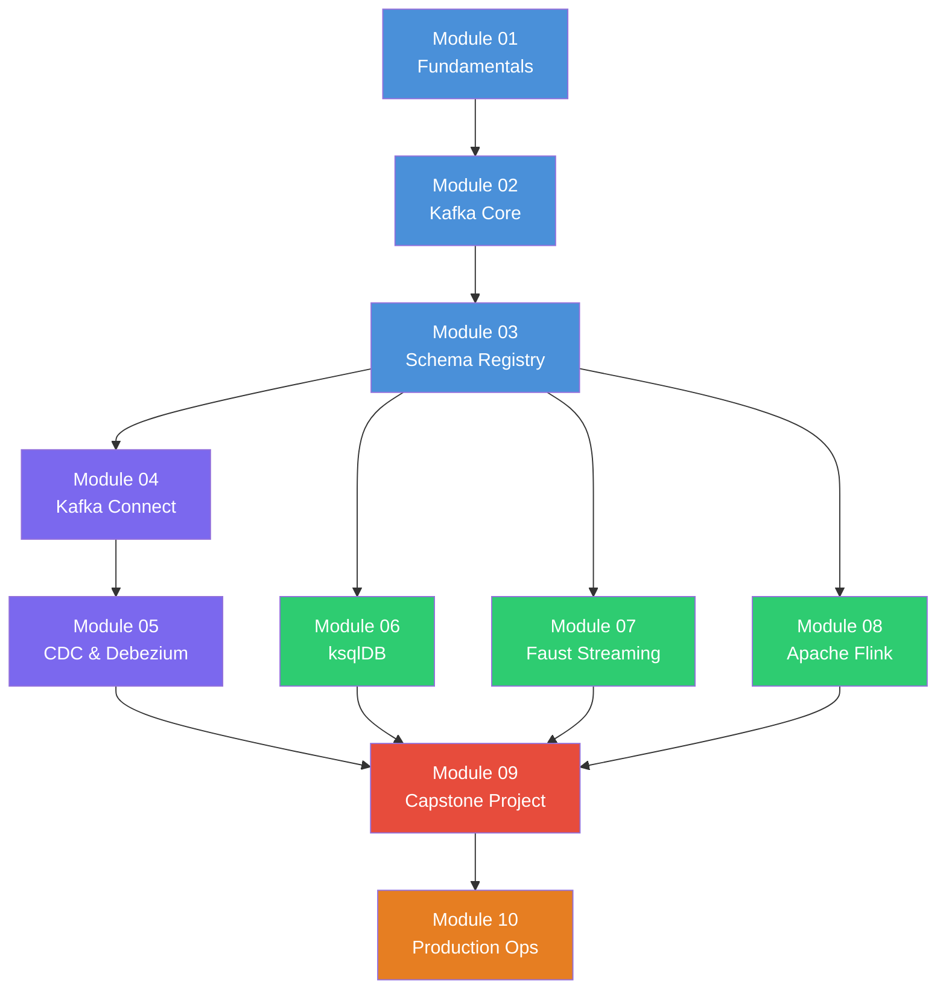

# Data Streaming Mastery

A comprehensive, hands-on course that takes you from Kafka fundamentals to building production-grade real-time data pipelines. Every module includes exercises, solutions, and Docker-based environments so you can learn by doing.

## Prerequisites

Before starting this course, make sure you have:

- **Docker Desktop** (v4.20+) with Docker Compose v2
- **Python 3.9+** with `pip` and `venv`
- **Basic SQL** knowledge (SELECT, JOIN, GROUP BY, window functions)
- **Familiarity with the command line** (bash / zsh)
- A machine with **16 GB RAM recommended** (8 GB minimum) and **20 GB free disk space**

See [SETUP.md](SETUP.md) for detailed installation instructions.

## Course Outline

| # | Module | Description |
|---|--------|-------------|
| 01 | [Fundamentals](module-01-fundamentals/) | Event-driven architecture, messaging patterns, streaming vs. batch, and the Kafka ecosystem overview |
| 02 | [Kafka Core](module-02-kafka-core/) | Producers, consumers, topics, partitions, consumer groups, offsets, and the Kafka protocol |
| 03 | [Schema Registry](module-03-schema-registry/) | Avro, JSON Schema, Protobuf with Confluent Schema Registry; compatibility modes and schema evolution |
| 04 | [Kafka Connect](module-04-kafka-connect/) | Source and sink connectors, Single Message Transforms (SMTs), distributed vs. standalone mode |
| 05 | [CDC with Debezium](module-05-cdc-debezium/) | Change Data Capture from MySQL/PostgreSQL, snapshot modes, schema changes, and outbox pattern |
| 06 | [ksqlDB](module-06-ksqldb/) | Stream processing with SQL: streams, tables, windowed aggregations, pull/push queries |
| 07 | [Faust Streaming](module-07-faust-streaming/) | Python stream processing with Faust: agents, tables, windowing, and web views |
| 08 | [Apache Flink](module-08-flink/) | Stateful stream processing with Flink SQL and the DataStream API; watermarks and event time |
| 09 | [Capstone Project](module-09-capstone/) | End-to-end real-time analytics pipeline combining CDC, stream processing, and monitoring |
| 10 | [Production Operations](module-10-production/) | Cluster sizing, security (TLS/SASL), monitoring, disaster recovery, and multi-datacenter replication |

## Learning Path



**Legend:** Blue = Core Kafka | Purple = Integration | Green = Stream Processing | Red = Capstone | Orange = Operations

## Quick Start

```bash
# 1. Clone the repository
git clone <repo-url> data-streaming-mastery
cd data-streaming-mastery

# 2. Create a Python virtual environment
python3 -m venv .venv
source .venv/bin/activate
pip install --upgrade pip

# 3. Start Module 01
cd module-01-fundamentals
# Follow the module README for exercises

# 4. (Optional) Launch the full capstone stack
cd ../
docker compose up -d
```

Each module has its own `exercises/` and `solutions/` directory. Work through the exercises first, then check your work against the solutions.

## Repository Structure

```
data-streaming-mastery/
├── README.md                  # This file
├── SETUP.md                   # Detailed environment setup
├── docker-compose.yml         # Master compose for the capstone
├── data-generators/           # Shared data generators
├── module-01-fundamentals/    # Concepts and theory
├── module-02-kafka-core/      # Kafka producers and consumers
├── module-03-schema-registry/ # Schema management
├── module-04-kafka-connect/   # Connector framework
├── module-05-cdc-debezium/    # Change Data Capture
├── module-06-ksqldb/          # SQL stream processing
├── module-07-faust-streaming/ # Python stream processing
├── module-08-flink/           # Apache Flink
├── module-09-capstone/        # End-to-end project
└── module-10-production/      # Production readiness
```

## Getting Help

1. Check the **Troubleshooting** section in [SETUP.md](SETUP.md)
2. Review the module-specific README for known issues
3. Open an issue in the repository if you hit a bug
