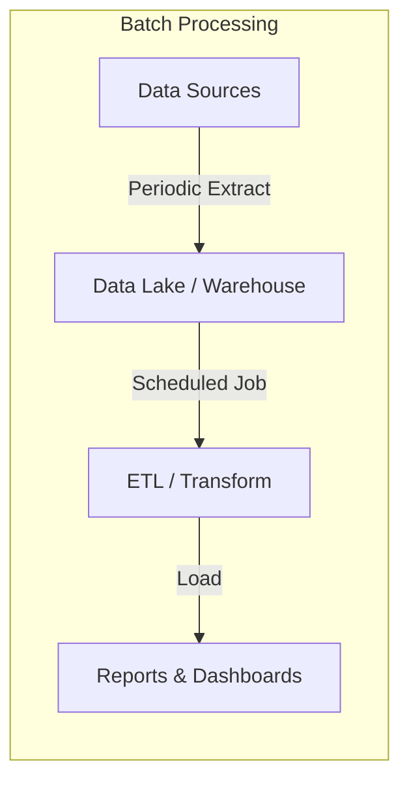
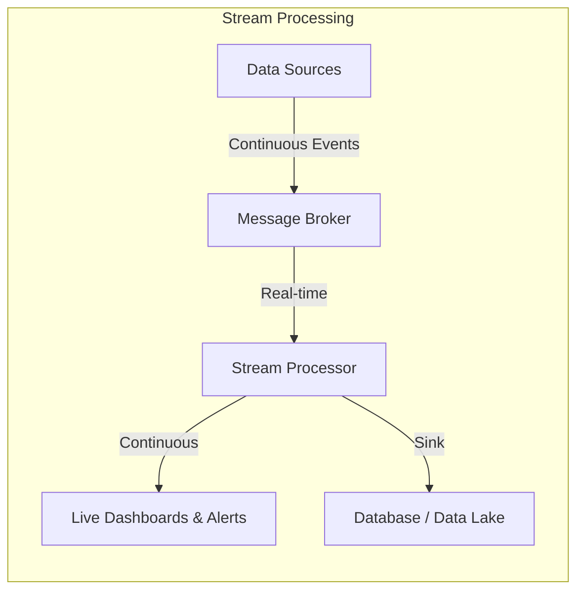
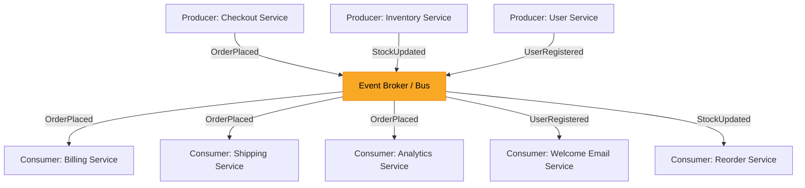
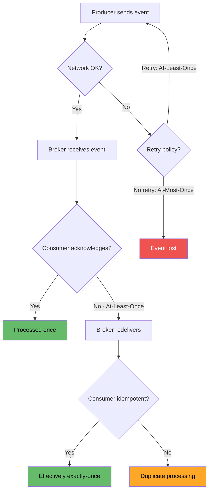

# Module 1: Streaming Fundamentals

> **Theory-only module** -- no code or infrastructure required.
> Estimated study time: 2-3 hours.

---

## Table of Contents

1. [What Is an Event?](#1-what-is-an-event)
2. [Events vs Messages vs Commands](#2-events-vs-messages-vs-commands)
3. [Streaming vs Batch Processing](#3-streaming-vs-batch-processing)
4. [Event-Driven Architecture](#4-event-driven-architecture)
5. [Delivery Guarantees](#5-delivery-guarantees)
6. [Time Semantics](#6-time-semantics-event-time-vs-processing-time-vs-ingestion-time)
7. [Backpressure](#7-backpressure)
8. [Event Sourcing and CQRS](#8-event-sourcing-and-cqrs)
9. [Key Takeaways](#9-key-takeaways)
10. [Next Steps](#10-next-steps)

---

## 1. What Is an Event?

An **event** is an immutable record of something that happened at a specific point in time. Events are facts -- once they occur, they cannot be undone, only compensated for.

### Real-World Analogies

| Domain | Event Example | Key Properties |
|---|---|---|
| Banking | "Account #4521 was debited $50.00 at 14:32 UTC" | Timestamp, account ID, amount, direction |
| E-commerce | "User added Nike Air Max to cart" | User ID, product SKU, timestamp |
| IoT / Smart Home | "Living room temperature sensor read 72.3 F" | Sensor ID, reading, unit, timestamp |
| Social Media | "User @alice liked post #9823" | Actor, action, target, timestamp |
| Ride-sharing | "Driver accepted ride request #R-1001" | Driver ID, ride ID, GPS coordinates, timestamp |
| Push Notification | "Your package has been delivered" | Recipient, message, delivery timestamp |

### Anatomy of an Event

Every well-structured event contains:

```
+-----------------------------------------------------+
|  EVENT                                               |
|-----------------------------------------------------|
|  key:        "user-42"                               |
|  timestamp:  2026-02-19T10:15:30Z                    |
|  type:       "order.placed"                          |
|  payload:    { orderId: "ORD-99", total: 149.99 }    |
|  metadata:   { source: "checkout-service", v: 2 }    |
+-----------------------------------------------------+
```

- **Key** -- identifies the entity the event belongs to (enables partitioning and ordering).
- **Timestamp** -- when the event occurred in the real world.
- **Type** -- a human-readable name describing what happened.
- **Payload** -- the data associated with the event.
- **Metadata** -- contextual information (source system, schema version, correlation IDs).

### Why Immutability Matters

Think of events like entries in a bank ledger. When a bank corrects an error, it does not erase the original entry. Instead, it appends a new entry that compensates for the mistake. This audit trail is the foundation of event-driven systems and event sourcing.

---

## 2. Events vs Messages vs Commands

These three terms are often used interchangeably, but they have distinct meanings in distributed systems.

| Aspect | Event | Message | Command |
|---|---|---|---|
| **Definition** | A record of something that already happened | A generic unit of data transmitted between systems | A request for something to happen |
| **Tense** | Past tense ("OrderPlaced") | N/A (it is the envelope) | Imperative ("PlaceOrder") |
| **Direction** | Broadcast to anyone interested | Point-to-point or broadcast | Directed at a specific handler |
| **Coupling** | Loose -- producer does not know consumers | Varies | Tight -- sender expects a specific receiver |
| **Failure** | Producer does not care if nobody listens | Depends on protocol | Sender typically expects acknowledgement |
| **Example** | "TemperatureRecorded: 98.6 F" | (the envelope carrying the event or command) | "SetThermostat: 72 F" |

### Analogy: The Restaurant

- **Command**: A customer says "I would like the steak, medium rare." This is directed at the waiter and expects execution.
- **Event**: The kitchen announces "Order #47 is ready." Anyone who cares (waiter, manager, expediter) can react.
- **Message**: The slip of paper that carries either the order or the announcement from one place to another.

### When to Use Each

- Use **events** when you want to decouple producers and consumers and allow multiple systems to react independently.
- Use **commands** when you need a specific action performed and you care about the outcome.
- Use **messages** as the transport mechanism for both events and commands.

---

## 3. Streaming vs Batch Processing

### The Core Difference

- **Batch processing**: Collect data over a period, then process it all at once. Think of doing your laundry -- you accumulate dirty clothes, then wash them in a single load.
- **Stream processing**: Process each piece of data as it arrives. Think of a factory assembly line -- each item is worked on the moment it reaches a station.

### Comparison Table

| Dimension | Batch Processing | Stream Processing |
|---|---|---|
| **Latency** | Minutes to hours | Milliseconds to seconds |
| **Data scope** | Finite, bounded datasets | Infinite, unbounded streams |
| **Processing trigger** | Scheduled (cron, orchestrator) | Continuous (event arrival) |
| **State management** | Typically stateless per run | Requires stateful operators |
| **Complexity** | Lower | Higher |
| **Error recovery** | Rerun the entire batch | Checkpointing, exactly-once semantics |
| **Resource usage** | Bursty (peaks during runs) | Steady, constant |
| **Typical tools** | Spark (batch), Hive, dbt, Airflow | Kafka Streams, Flink, Faust, ksqlDB |
| **Use case example** | Daily sales report | Real-time fraud detection |
| **Data freshness** | Stale until next run | Near real-time |

### Architecture Comparison





### When to Use Each

**Choose Batch when:**
- Data freshness of hours or days is acceptable
- You need complex aggregations over huge historical datasets
- Cost efficiency is more important than latency
- Your downstream consumers only need periodic updates (e.g., daily financial reports)

**Choose Streaming when:**
- You need sub-second or second-level latency
- You are reacting to events (fraud, anomalies, alerts)
- Data is naturally produced as a continuous stream (clickstreams, IoT sensors, logs)
- You need to maintain real-time materialized views

**Choose Both (Lambda / Kappa architecture) when:**
- You need real-time results AND historical reprocessing
- Regulatory requirements demand both immediate alerts and end-of-day reconciliation

---

## 4. Event-Driven Architecture

Event-Driven Architecture (EDA) is a software design pattern where the flow of the program is determined by events rather than sequential procedure calls.

### Core Components



### Key Principles

1. **Loose coupling** -- Producers do not know or care who consumes their events. Adding a new consumer requires zero changes to the producer.

2. **Single responsibility** -- Each service owns its domain and publishes events about state changes in that domain.

3. **Eventual consistency** -- Systems may be temporarily inconsistent but will converge to a consistent state. A customer might briefly see "order placed" before their inventory count updates.

4. **Autonomy** -- Each service can be developed, deployed, and scaled independently.

### Topologies

| Topology | Description | Example |
|---|---|---|
| **Mediator** | A central orchestrator routes events and coordinates workflows | An order orchestrator that calls payment, then inventory, then shipping in sequence |
| **Broker** | No central coordinator; services react to events independently | Each service subscribes to the events it cares about and acts on its own |

### Real-World Analogy: The Newspaper

Think of a newspaper publishing company:
- The **journalists** (producers) write articles and submit them.
- The **printing press** (event broker) publishes the newspaper.
- **Subscribers** (consumers) each receive the same paper but read different sections. The sports fan reads sports; the investor reads finance. The journalist has no idea who reads their article.

Adding a new subscriber does not require the journalist to change anything.

---

## 5. Delivery Guarantees

When events travel from producer to consumer through a broker, things can go wrong: networks fail, services crash, disks fill up. Delivery guarantees define what the system promises when failures occur.

### The Three Guarantees

#### At-Most-Once ("Fire and Forget")

```
Producer ---> Broker ---> Consumer
   |                         |
   "I sent it. Not my        "I might get it,
    problem anymore."         or I might not."
```

- The producer sends the event and does not retry on failure.
- The event may be **lost** but is never **duplicated**.
- **Analogy**: Sending a postcard. You drop it in the mailbox. If it gets lost, you will never know, and you will not send it again.
- **Use cases**: Metrics collection, logging, telemetry where occasional data loss is tolerable.

#### At-Least-Once ("Keep Trying")

```
Producer ---> Broker ---> Consumer
   |             |            |
   "Did you      "Yes/No"     "I got it!
    get it?"                   ...wait, I got
   (retries)                   it again?"
```

- The producer retries until it receives acknowledgement.
- The event is **never lost** but may be **duplicated**.
- **Analogy**: Sending a registered letter. If you do not get the delivery confirmation, you send it again. The recipient might end up with two copies.
- **Use cases**: Order processing, payment events -- anything where losing an event is unacceptable but you can handle duplicates (via idempotency).

#### Exactly-Once ("The Gold Standard")

```
Producer ---> Broker ---> Consumer
   |             |            |
   "Transaction  "Committed"  "Processed
    ID: TXN-42"               TXN-42 once
   (dedup +                    and only once."
    transactions)
```

- Each event is delivered and processed **exactly one time**, even in the face of failures.
- **Analogy**: A bank wire transfer. The bank ensures that even if systems crash mid-transfer, your money moves exactly once -- not zero times, not twice.
- **Use cases**: Financial transactions, billing, inventory updates.
- **Reality check**: True exactly-once is expensive. Most systems achieve it through a combination of at-least-once delivery + idempotent consumers + transactional processing.

### Delivery Guarantees Flow



### Choosing a Guarantee

| Guarantee | Data Loss? | Duplicates? | Performance | Complexity |
|---|---|---|---|---|
| At-most-once | Possible | No | Highest | Lowest |
| At-least-once | No | Possible | Medium | Medium |
| Exactly-once | No | No | Lowest | Highest |

**Rule of thumb**: Start with at-least-once and make your consumers idempotent. This gives you the best balance of safety and performance.

---

## 6. Time Semantics: Event Time vs Processing Time vs Ingestion Time

Time is one of the trickiest concepts in stream processing. The same event can have three different timestamps, and confusing them leads to incorrect results.

### Definitions

| Time Type | Definition | Who Sets It | Example |
|---|---|---|---|
| **Event time** | When the event actually occurred in the real world | The producer / source system | "The sensor reading happened at 14:00:00" |
| **Ingestion time** | When the event entered the streaming platform (broker) | The broker (e.g., Kafka) | "Kafka received the event at 14:00:03" |
| **Processing time** | When the stream processor actually processes the event | The consumer / processor | "Flink processed the event at 14:00:07" |

### Timeline Diagram

```
Real World          Broker              Processor
    |                  |                    |
    | Event occurs     |                    |
    | t=14:00:00       |                    |
    |                  |                    |
    |---( network )---->                    |
    |                  | Ingested           |
    |                  | t=14:00:03         |
    |                  |                    |
    |                  |---( queue )-------->
    |                  |                    | Processed
    |                  |                    | t=14:00:07
    |                  |                    |

    |<-- 3 sec lag --->|<---- 4 sec lag --->|
    |<----------- 7 sec total lag --------->|
```

### Why Does This Matter?

Imagine you are counting website clicks per minute for a real-time dashboard.

- **If you use processing time**: A burst of delayed events could make minute 14:05 look like it had massive traffic, when in reality the events happened at 14:00. Your dashboard lies.
- **If you use event time**: The events are attributed to the correct minute (14:00), giving you an accurate picture. However, you need to handle late-arriving data.

### Late-Arriving Events and Watermarks

When using event time, you face a fundamental question: "How long do I wait for late events before closing a time window?"

A **watermark** is the system's estimate of progress in event time. It says: "I believe all events with timestamps up to this point have arrived."

```
Events arriving:   [14:00] [14:01] [14:02]  ... [13:58]  <-- late!
                                                    |
Watermark at 14:02: "I believe all events         |
  up to 14:02 have arrived"                       |
                                                    |
                                          This event is LATE.
                                          Was the window for 13:58
                                          already closed?
```

**Allowed lateness** defines how long windows stay open for stragglers. Setting this involves a trade-off:
- Too short: You lose late events.
- Too long: Results are delayed and you use more memory.

### Real-World Analogy: The Exam

- **Event time**: When the student finished writing the exam (stamped on the paper).
- **Ingestion time**: When the exam reached the professor's desk.
- **Processing time**: When the professor graded it.

If exams are sorted by processing time, a paper stuck in campus mail for two days looks like it was submitted late. Sorting by event time gives the true picture.

---

## 7. Backpressure

### What Is Backpressure?

Backpressure occurs when a downstream system cannot keep up with the rate of incoming data from an upstream system. Without a mechanism to handle it, the system either crashes, drops data, or runs out of memory.

### The Water Pipe Analogy

```
        [High-pressure source]
               |
               v
    ========================
    |   Wide pipe (fast    |   <-- Producer: 10,000 events/sec
    |   producer)          |
    ========================
               |
               v
    ========
    | Narrow |                 <-- Consumer: 1,000 events/sec
    | pipe   |
    ========
               |
               v
         OVERFLOW!             <-- Backpressure! What happens to the
                                   other 9,000 events/sec?
```

### Strategies for Handling Backpressure

| Strategy | Description | Analogy |
|---|---|---|
| **Buffering** | Queue events in a buffer until the consumer catches up | A reservoir that absorbs peak water flow |
| **Dropping** | Discard events that exceed capacity | An overflow drain on a bathtub |
| **Sampling** | Process only a subset of events | Tasting every 10th bottle on a wine production line |
| **Flow control** | Signal the producer to slow down | A traffic light at a highway on-ramp |
| **Scaling** | Add more consumer instances | Opening more checkout lanes at a grocery store |

### Backpressure in Practice

- **Kafka** handles backpressure naturally through its pull-based model. Consumers read at their own pace. If they fall behind, data stays in the topic (retained by Kafka's configurable retention policy). The consumer eventually catches up.
- **Push-based systems** (e.g., WebSockets, some message queues) are more susceptible to backpressure because the broker pushes data to the consumer regardless of whether it is ready.
- **Reactive Streams** (e.g., Project Reactor, RxJava) have backpressure built into the protocol -- the consumer signals how many items it can accept.

---

## 8. Event Sourcing and CQRS

### Event Sourcing

Traditional databases store the **current state** of an entity. Event sourcing stores every **state change** as an immutable event, and derives the current state by replaying events.

#### Traditional (State-Based) vs Event Sourcing

**Traditional approach -- Bank Account:**

| account_id | balance |
|---|---|
| ACC-100 | $950.00 |

You see the balance but have no idea how you got there.

**Event sourcing approach -- Bank Account:**

| event_id | account_id | type | amount | timestamp |
|---|---|---|---|---|
| 1 | ACC-100 | AccountOpened | $0.00 | 2026-01-01 |
| 2 | ACC-100 | Deposited | +$1000.00 | 2026-01-02 |
| 3 | ACC-100 | Withdrawn | -$50.00 | 2026-01-15 |

Current balance = replay events: $0 + $1000 - $50 = **$950.00**

#### Benefits of Event Sourcing

1. **Complete audit trail** -- You know exactly what happened and when.
2. **Time travel** -- You can reconstruct the state at any point in the past.
3. **Debugging** -- Reproduce bugs by replaying the exact sequence of events.
4. **Flexibility** -- Build new projections (views) from the same event stream.

#### Challenges

1. **Event schema evolution** -- Events are immutable, but business requirements change. You need versioning strategies.
2. **Replay performance** -- Replaying millions of events is slow. Snapshots help.
3. **Complexity** -- More moving parts than a simple CRUD application.

### CQRS (Command Query Responsibility Segregation)

CQRS separates the **write model** (commands) from the **read model** (queries). This is a natural companion to event sourcing.

```
                     +-------------------+
   Command --------> | Write Model       |
   (PlaceOrder)      | (Event Store)     |
                     +-------------------+
                              |
                         Events published
                              |
                     +-------------------+
                     | Read Model        | <-------- Query
                     | (Optimized View)  |          (GetOrderHistory)
                     +-------------------+
```

**Why separate reads and writes?**
- **Reads** and **writes** often have very different performance requirements.
- The write model can be optimized for consistency (event store, append-only log).
- The read model can be optimized for query speed (denormalized tables, search indexes, caches).

**Analogy**: A library. The cataloging department (write model) carefully organizes and records every book. The card catalog / search computer (read model) is optimized so visitors can quickly find what they need. They are separate systems with different optimization goals.

---

## 9. Key Takeaways

1. **Events are immutable facts** about things that happened. They are the atomic building blocks of streaming systems.

2. **Events, messages, and commands are different things.** Events record the past; commands request the future; messages are the envelopes.

3. **Streaming processes data continuously; batch processes data in chunks.** Choose based on your latency requirements and data characteristics. Many production systems use both.

4. **Event-driven architecture decouples producers and consumers** through a broker, enabling independent scaling and evolution of services.

5. **Delivery guarantees are a spectrum.** At-most-once is fast but lossy; exactly-once is safe but expensive. At-least-once with idempotent consumers is the pragmatic sweet spot.

6. **Time is not simple in distributed systems.** Always be explicit about which time you mean. Use event time for correctness; understand watermarks for handling late data.

7. **Backpressure is inevitable.** Design for it from the start. Kafka's pull-based model is one of the reasons it is so popular.

8. **Event sourcing stores history; CQRS separates reads from writes.** Together, they enable powerful patterns for audit, debugging, and performance optimization.

---

## 10. Next Steps

You now have a solid theoretical foundation in streaming concepts. In the next module, you will put these ideas into practice with Apache Kafka, the most widely adopted event streaming platform.

**[Continue to Module 2: Kafka Core -->](../module-02-kafka-core/)**

---

### Exercises and Quiz

Before moving on, test your understanding:

- [Exercise 1: Streaming Concepts](exercises/01-concepts.md)
- [Exercise 2: Architecture Design](exercises/02-architecture.md)
- [Quiz: Streaming Fundamentals](quiz.md)

Solutions are available in the [solutions/](solutions/) directory.
