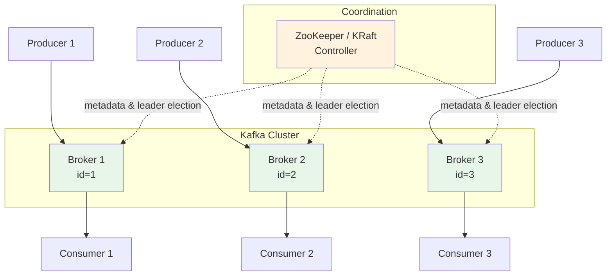
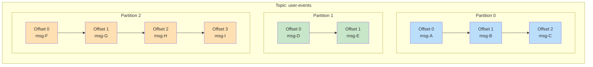
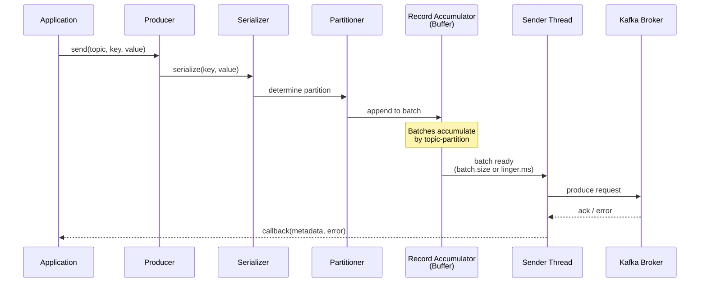
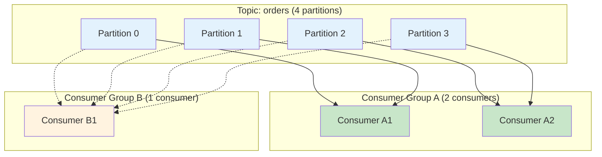
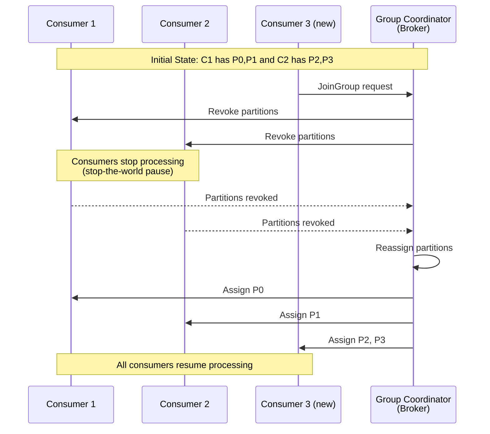
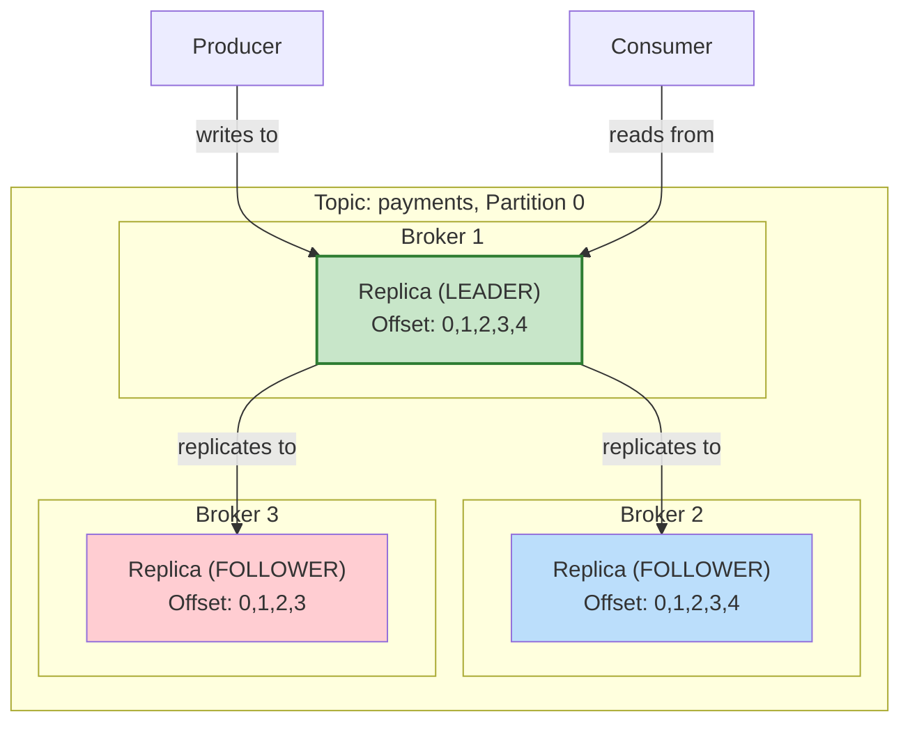

# Module 2: Apache Kafka Core Concepts

## Table of Contents

1. [What is Apache Kafka?](#what-is-apache-kafka)
2. [Architecture](#architecture)
3. [Topics and Partitions](#topics-and-partitions)
4. [Producers](#producers)
5. [Consumers](#consumers)
6. [Offsets](#offsets)
7. [Message Format](#message-format)
8. [Replication](#replication)
9. [Key Takeaways](#key-takeaways)
10. [Next Steps](#next-steps)

---

## What is Apache Kafka?

Apache Kafka is a distributed event streaming platform capable of handling trillions of events per day. Originally developed at LinkedIn and open-sourced in 2011, Kafka has become the backbone of real-time data pipelines at companies like Netflix, Uber, and Airbnb.

### The Post Office Analogy

Think of Kafka as a **high-tech post office**:

| Post Office | Kafka |
|---|---|
| Post office building | **Broker** (a Kafka server) |
| Chain of post offices | **Cluster** (multiple brokers working together) |
| Mailboxes sorted by address | **Topics** (named categories for messages) |
| Individual mail slots in a mailbox | **Partitions** (subdivisions of a topic) |
| Person sending a letter | **Producer** (application that publishes messages) |
| Person receiving mail | **Consumer** (application that reads messages) |
| Tracking number / receipt | **Offset** (position of a message in a partition) |
| Mail carrier routes | **Consumer Groups** (coordinated consumers sharing the work) |

Just like a post office:
- Senders (producers) drop off mail (messages) without knowing who will pick it up.
- Recipients (consumers) check their mailbox (topic) at their own pace.
- Mail is kept for a configurable period even after being read (retention).
- Multiple people can read the same mail (multiple consumer groups).

---

## Architecture

### Brokers and Clusters

A **broker** is a single Kafka server. It receives messages from producers, stores them on disk, and serves them to consumers. In production, you run multiple brokers together as a **cluster** for fault tolerance and scalability.



### ZooKeeper vs KRaft

Historically, Kafka used **Apache ZooKeeper** for:
- Broker registration and discovery
- Leader election for partitions
- Configuration management
- Health monitoring

Starting with Kafka 3.3+, **KRaft mode** (Kafka Raft) replaces ZooKeeper:
- Metadata is managed within Kafka itself
- Eliminates the operational burden of running ZooKeeper
- Faster controller failover
- Simplified deployment

> **Note:** Our Docker setup uses ZooKeeper for compatibility, but production deployments should consider KRaft for new clusters.

---

## Topics and Partitions

### The Filing Cabinet Analogy

Think of a Kafka topic as a **filing cabinet**:

- The **cabinet label** is the topic name (e.g., `user-events`).
- Each **drawer** in the cabinet is a **partition**.
- **Documents** (messages) are filed sequentially into drawers and each gets a number (offset).
- You can only add documents to the end of a drawer (append-only).
- Multiple clerks (consumers) can read from different drawers simultaneously.



### Key Properties of Topics

| Property | Description | Default |
|---|---|---|
| `num.partitions` | Number of partitions | 1 |
| `replication.factor` | Copies across brokers | 1 |
| `retention.ms` | How long to keep messages | 7 days (604800000) |
| `retention.bytes` | Max size per partition | -1 (unlimited) |
| `cleanup.policy` | `delete` or `compact` | delete |
| `min.insync.replicas` | Min replicas that must ack | 1 |

### Choosing the Number of Partitions

- More partitions = more parallelism for consumers
- More partitions = more file handles, memory, and leader elections
- Rule of thumb: start with **number of consumers you expect** in the largest consumer group
- You can increase partitions later, but **not decrease** them
- Messages with the same key always go to the same partition (assuming partition count doesn't change)

---

## Producers

A producer sends records to Kafka topics. It handles serialization, partitioning, batching, and delivery guarantees.

### Producer Flow



### Partitioning Strategies

| Strategy | When Used | Behavior |
|---|---|---|
| **Key-based** (default) | Key is not null | `hash(key) % num_partitions` -- same key always goes to same partition |
| **Round-robin** | Key is null | Messages distributed evenly across partitions |
| **Sticky** | Key is null (Kafka 2.4+) | Fills one batch before moving to next partition (better batching) |
| **Custom** | You implement it | Full control over partition selection |

### Acknowledgments (acks)

The `acks` setting controls durability guarantees:

| acks | Behavior | Durability | Throughput |
|---|---|---|---|
| `0` | Fire and forget, no ack waited | Lowest -- messages can be lost | Highest |
| `1` | Leader acknowledges write | Medium -- lost if leader fails before replication | Medium |
| `all` / `-1` | All in-sync replicas acknowledge | Highest -- no data loss (with proper ISR config) | Lowest |

### Retries and Idempotence

**Retries:** If a produce request fails, the producer can automatically retry. Default is `MAX_INT` (essentially infinite) with a `delivery.timeout.ms` of 120 seconds.

**Idempotent Producer** (`enable.idempotence=true`):
- Each producer gets a unique Producer ID (PID)
- Each message gets a monotonically increasing sequence number
- Broker deduplicates based on PID + sequence number
- Guarantees exactly-once delivery per partition
- Automatically sets `acks=all`, `retries=MAX_INT`, `max.in.flight.requests.per.connection<=5`

---

## Consumers

A consumer reads records from Kafka topics. Consumers are typically part of a **consumer group** for scalable processing.

### Consumer Groups

A consumer group is a set of consumers that cooperate to consume a topic:

- Each partition is assigned to **exactly one consumer** within a group
- Multiple groups can independently read the same topic
- Adding consumers to a group triggers **rebalancing**



### Partition Assignment Strategies

| Strategy | Description |
|---|---|
| **Range** (default) | Assigns contiguous partitions to each consumer per topic |
| **RoundRobin** | Distributes partitions one-by-one across consumers |
| **Sticky** | Like RoundRobin but minimizes partition movement during rebalancing |
| **CooperativeSticky** | Incremental rebalancing -- only reassigns partitions that need to move |

### Rebalancing

Rebalancing occurs when:
- A new consumer joins the group
- A consumer leaves or crashes
- New partitions are added to a subscribed topic
- The group coordinator detects a consumer has stopped sending heartbeats



---

## Offsets

An **offset** is a unique, sequential ID for each message within a partition. Offsets are the mechanism by which consumers track their position.

### Committed vs Current Offset

| Term | Meaning |
|---|---|
| **Current offset** | The offset of the next message the consumer will read (position in the partition) |
| **Committed offset** | The offset that has been persisted to Kafka (stored in `__consumer_offsets` topic) |
| **Lag** | The difference between the latest offset in the partition and the consumer's committed offset |

### Auto Commit vs Manual Commit

**Auto commit** (`enable.auto.commit=true`, default):
- Offsets are committed periodically (every `auto.commit.interval.ms`, default 5000ms)
- Simple but can lead to duplicates (crash after processing but before commit) or data loss (commit before processing completes)

**Manual commit:**
- `commitSync()` -- blocks until the broker confirms the offset commit
- `commitAsync()` -- non-blocking, uses a callback for confirmation
- Gives you full control over when offsets are committed
- Essential for **at-least-once** or **exactly-once** processing guarantees

### Offset Reset Policies

When a consumer group has no committed offset (new group or offset expired):

| Policy | Behavior |
|---|---|
| `earliest` | Start from the beginning of the partition |
| `latest` | Start from the end, only reading new messages |
| `error` | Throw an exception if no offset is found |

---

## Message Format

Every Kafka message (also called a **record**) consists of:

```
+------------------+
|  Record          |
+------------------+
|  Key (bytes)     |  -- Optional. Used for partitioning and compaction.
|  Value (bytes)   |  -- The actual payload. Can be any format (JSON, Avro, Protobuf).
|  Headers (list)  |  -- Optional key-value metadata pairs.
|  Timestamp (ms)  |  -- CreateTime (producer) or LogAppendTime (broker).
|  Offset (long)   |  -- Assigned by the broker. Unique per partition.
|  Partition (int)  |  -- Which partition the record belongs to.
+------------------+
```

### Key Points about Keys

- If the key is `null`, the message is distributed via round-robin (or sticky partitioner).
- If the key is set, `hash(key) % num_partitions` determines the partition.
- Same key = same partition = **ordering guarantee** for that key.
- Common key choices: user ID, device ID, order ID.

### Common Serialization Formats

| Format | Pros | Cons |
|---|---|---|
| **JSON** | Human-readable, flexible | Large, no schema enforcement |
| **Avro** | Compact, schema evolution, Schema Registry | Requires Schema Registry |
| **Protobuf** | Compact, fast, strong typing | More complex setup |
| **String** | Simplest | No structure |

---

## Replication

Replication is how Kafka achieves fault tolerance. Each partition has one **leader** and zero or more **followers** (replicas).

### Leader and Followers



### In-Sync Replicas (ISR)

The ISR is the set of replicas that are "caught up" to the leader:

- A follower is in the ISR if it has replicated all messages within `replica.lag.time.max.ms` (default 30s)
- Only ISR members are eligible to become the new leader if the current leader fails
- **`min.insync.replicas`** sets the minimum number of replicas (including the leader) that must acknowledge a write when `acks=all`

### Replication Configuration Examples

| Scenario | `replication.factor` | `min.insync.replicas` | `acks` | Behavior |
|---|---|---|---|---|
| Development | 1 | 1 | 1 | No redundancy, fast |
| Standard | 3 | 2 | all | Tolerates 1 broker failure |
| High durability | 3 | 2 | all | With idempotent producer: exactly-once per partition |

### What Happens When a Broker Fails?

1. The controller detects the broker is down (via ZooKeeper session timeout or KRaft heartbeat)
2. For each partition where the failed broker was the leader, a new leader is elected from the ISR
3. Producers and consumers update their metadata and redirect to the new leader
4. When the broker comes back, it rejoins as a follower and catches up

---

## Key Takeaways

1. **Kafka is a distributed commit log** -- messages are appended sequentially and retained for a configurable period.
2. **Topics are split into partitions** for parallelism. Partitions are the unit of parallelism and replication.
3. **Producers choose which partition** a message goes to, either by key hash, round-robin, or custom logic.
4. **Consumer groups enable scalable consumption** -- each partition is read by exactly one consumer in a group.
5. **Offsets track consumer progress** -- commit strategies determine your processing guarantees (at-most-once, at-least-once, exactly-once).
6. **Replication provides fault tolerance** -- configure `replication.factor`, `min.insync.replicas`, and `acks` together for your durability needs.
7. **Idempotent producers** eliminate duplicates from retries at the partition level.
8. **Rebalancing is the most complex consumer behavior** -- use cooperative strategies to minimize disruption.

---

## Next Steps

Proceed to [Module 3: Schema Registry](../module-03-schema-registry/README.md) to learn how to enforce schemas on your Kafka messages using Avro, Protobuf, and JSON Schema with the Confluent Schema Registry.

---

## Hands-On Labs

Before moving on, complete the exercises in this module:

1. [Producer Exercises](exercises/01-producers.md)
2. [Consumer Exercises](exercises/02-consumers.md)
3. [Partitioning Exercises](exercises/03-partitioning.md)

Then check your answers against the [solutions](solutions/).

Take the [Module Quiz](quiz.md) to test your understanding.
