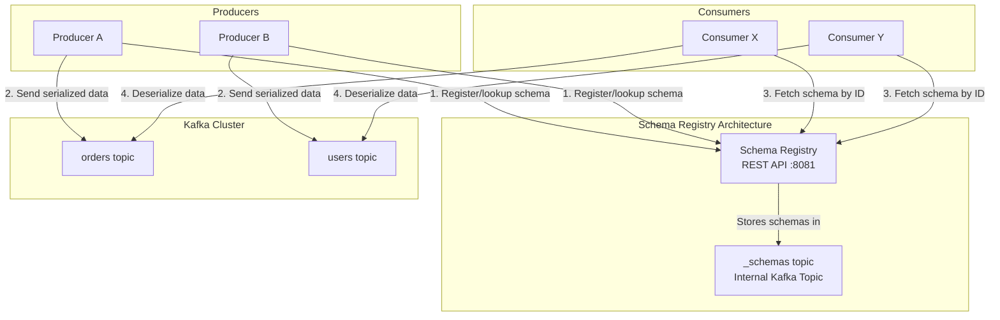
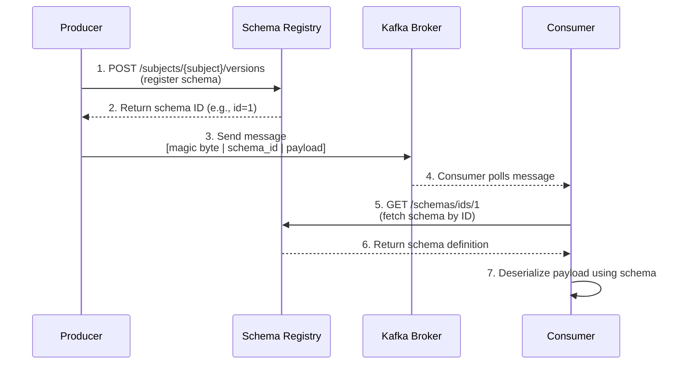
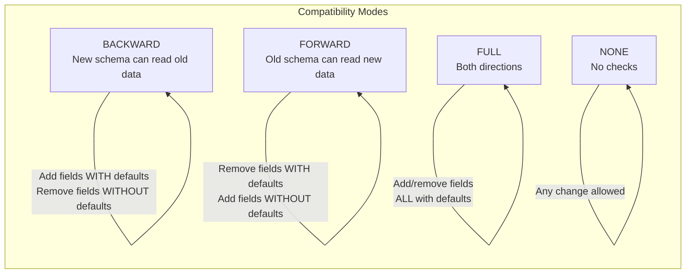

# Module 3: Schema Registry & Serialization

## Table of Contents

1. [Why Schemas Matter in Streaming](#why-schemas-matter-in-streaming)
2. [Schema Registry Architecture](#schema-registry-architecture)
3. [Serialization Formats Comparison](#serialization-formats-comparison)
4. [Avro Deep Dive](#avro-deep-dive)
5. [Schema Evolution](#schema-evolution)
6. [Compatibility Modes](#compatibility-modes)
7. [Subject Naming Strategies](#subject-naming-strategies)
8. [Hands-On Exercises](#hands-on-exercises)
9. [Key Takeaways](#key-takeaways)
10. [Next Steps](#next-steps)

---

## Why Schemas Matter in Streaming

Kafka treats messages as opaque bytes. Without schemas, producers and consumers must independently agree on data format -- and that agreement is fragile. When one team changes a field name or removes a column, downstream consumers break silently or crash at runtime.

**The Contract Analogy:** A schema is a *contract* between producers and consumers. Just as a legal contract specifies obligations for both parties, a schema specifies:

- What fields exist in a message
- What types those fields have
- Which fields are required vs. optional
- What default values apply

Without this contract, your streaming platform devolves into a game of telephone where each team interprets bytes differently.

### The Cost of Schema-less Streaming

| Problem | Impact |
|---------|--------|
| Producer changes field type from `int` to `string` | Consumer deserialization crashes |
| Producer removes a required field | Consumer gets null pointer exceptions |
| Producer adds a field consumer doesn't expect | Consumer silently drops data |
| No documentation of message format | New teams cannot onboard |
| Multiple versions of same event in same topic | Impossible to parse consistently |

Schema Registry solves all of these problems by centralizing schema management and enforcing compatibility rules.

---

## Schema Registry Architecture

The Confluent Schema Registry is a serving layer for your metadata. It provides a RESTful interface for storing and retrieving schemas (Avro, Protobuf, JSON Schema) and enforces compatibility policies.



### How It Works: Producer/Consumer Flow



### Wire Format

Every message serialized through Schema Registry uses this 5-byte prefix:

```
[0x00] [4-byte schema ID] [Avro/Protobuf/JSON payload]
 ^         ^                    ^
 |         |                    |
 magic     schema ID used       actual serialized data
 byte      to look up schema
```

The magic byte (`0x00`) identifies this as a Schema Registry-encoded message. The 4-byte schema ID allows the consumer to retrieve the correct schema for deserialization.

---

## Serialization Formats Comparison

Schema Registry supports three serialization formats. Here is a detailed comparison:

| Feature | Avro | Protobuf | JSON Schema |
|---------|------|----------|-------------|
| **Encoding** | Binary (compact) | Binary (compact) | Text (JSON) |
| **Schema location** | Embedded or in registry | `.proto` files or registry | JSON document or registry |
| **Schema evolution** | Excellent (built-in) | Excellent (field numbers) | Limited |
| **Human readable** | No (binary) | No (binary) | Yes |
| **Language support** | Java, Python, C, Go, ... | Nearly all languages | Nearly all languages |
| **Message size** | Small | Small | Large (field names in every message) |
| **Schema required to read** | Yes | Yes | No (but recommended) |
| **Dynamic typing** | Supported via unions | Limited (oneof) | Native |
| **Confluent support** | First-class | First-class | First-class |
| **Code generation** | Optional | Common practice | Optional |
| **Best for** | Data pipelines, analytics | Microservices, gRPC | Web APIs, debugging |

### Pros and Cons Summary

**Avro**
- Pros: Compact binary format, excellent schema evolution, no field tags needed, first-class Kafka ecosystem support
- Cons: Not human-readable, requires schema for both reading and writing, slower code generation

**Protobuf**
- Pros: Very compact, strong typing, great code generation, widely adopted in microservices
- Cons: Requires field numbers (manual management), not self-describing, more complex schema syntax

**JSON Schema**
- Pros: Human-readable, easy to debug, no special tooling to inspect messages, familiar syntax
- Cons: Larger message size (field names repeated), weaker evolution guarantees, slower serialization

---

## Avro Deep Dive

Apache Avro is the most commonly used serialization format with Kafka and Schema Registry. Understanding its type system is essential.

### Primitive Types

| Type | Description | Example |
|------|-------------|---------|
| `null` | No value | `null` |
| `boolean` | True or false | `true` |
| `int` | 32-bit signed integer | `42` |
| `long` | 64-bit signed integer | `1234567890123` |
| `float` | 32-bit IEEE 754 | `3.14` |
| `double` | 64-bit IEEE 754 | `3.141592653589793` |
| `bytes` | Sequence of bytes | `"\u00FF\u00FE"` |
| `string` | Unicode string | `"hello"` |

### Complex Types

**Record** -- A named collection of fields (like a struct or class):

```json
{
  "type": "record",
  "name": "Order",
  "namespace": "com.ecommerce",
  "fields": [
    {"name": "order_id", "type": "string"},
    {"name": "amount", "type": "double"},
    {"name": "items", "type": {"type": "array", "items": "string"}}
  ]
}
```

**Enum** -- A fixed set of string values:

```json
{
  "type": "enum",
  "name": "OrderStatus",
  "symbols": ["PENDING", "SHIPPED", "DELIVERED", "CANCELLED"]
}
```

**Array** -- An ordered collection of items of a single type:

```json
{"type": "array", "items": "string"}
```

**Map** -- Key-value pairs (keys are always strings):

```json
{"type": "map", "values": "int"}
```

**Union** -- A value that can be one of several types. Commonly used for nullable fields:

```json
["null", "string"]
```

**Fixed** -- A fixed number of bytes:

```json
{"type": "fixed", "name": "md5", "size": 16}
```

### Logical Types

Logical types annotate primitive or complex types with richer semantics:

| Logical Type | Underlying Type | Description |
|-------------|-----------------|-------------|
| `date` | `int` | Days since Unix epoch |
| `time-millis` | `int` | Milliseconds since midnight |
| `time-micros` | `long` | Microseconds since midnight |
| `timestamp-millis` | `long` | Milliseconds since Unix epoch |
| `timestamp-micros` | `long` | Microseconds since Unix epoch |
| `decimal` | `bytes` or `fixed` | Arbitrary-precision decimal |
| `uuid` | `string` | UUID string |

Example:

```json
{
  "name": "created_at",
  "type": {"type": "long", "logicalType": "timestamp-millis"}
}
```

### Unions (Nullable Fields)

The most common use of unions is making fields optional:

```json
{"name": "middle_name", "type": ["null", "string"], "default": null}
```

**Important rules:**
- The first type in a union is the default type
- If `"null"` is first, the default value should be `null`
- If `"string"` is first, you must provide a string default
- Unions cannot contain other unions directly

---

## Schema Evolution

Schema evolution is the ability to change a schema over time while maintaining compatibility with existing data. This is critical in streaming because producers and consumers are upgraded independently.

### Adding Fields

**Safe:** Add a new field with a default value:

```json
// V1
{"name": "order_id", "type": "string"}

// V2 -- added field with default
{"name": "order_id", "type": "string"},
{"name": "priority", "type": "string", "default": "normal"}
```

Old consumers ignore the new field. New consumers reading old data get the default value.

**Unsafe:** Add a new field without a default:

```json
{"name": "priority", "type": "string"}  // No default -- breaks backward compatibility!
```

### Removing Fields

**Safe:** Remove a field that had a default value:

```json
// V1
{"name": "order_id", "type": "string"},
{"name": "priority", "type": "string", "default": "normal"}

// V2 -- removed priority (it had a default, so old data can still be read)
{"name": "order_id", "type": "string"}
```

**Unsafe:** Remove a field that had no default value.

### Renaming Fields

Renaming is done via `aliases`:

```json
{
  "name": "customer_email",
  "type": "string",
  "aliases": ["email", "user_email"]
}
```

The aliases allow readers using the old field name to map to the new name.

---

## Compatibility Modes

Schema Registry enforces compatibility rules when you register a new version of a schema. The compatibility mode determines what changes are allowed.



### Compatibility Mode Details

| Mode | Description | Allowed Changes | Use Case |
|------|-------------|-----------------|----------|
| **BACKWARD** (default) | New schema can read data written with the old schema | Add fields with defaults; remove fields | Consumers upgraded before producers |
| **BACKWARD_TRANSITIVE** | New schema can read data written with ALL previous schemas | Same as BACKWARD, across all versions | Long-lived topics with many schema versions |
| **FORWARD** | Old schema can read data written with the new schema | Remove fields with defaults; add fields | Producers upgraded before consumers |
| **FORWARD_TRANSITIVE** | All previous schemas can read data written with the new schema | Same as FORWARD, across all versions | Critical systems where consumers lag behind |
| **FULL** | Both BACKWARD and FORWARD compatible | Add/remove only fields WITH defaults | Maximum safety |
| **FULL_TRANSITIVE** | FULL across all versions | Same as FULL, across all versions | Most strict -- enterprise environments |
| **NONE** | No compatibility checking | Any change | Development/testing only |

### What Breaks Each Mode

**BACKWARD compatibility is broken by:**
- Adding a required field (no default)
- Changing a field type incompatibly (e.g., `int` to `string`)
- Removing a default from an existing field

**FORWARD compatibility is broken by:**
- Removing a required field (no default)
- Changing a field type incompatibly
- Adding a field that old readers cannot handle

**FULL compatibility is broken by:**
- Any of the above
- Adding or removing fields without defaults

---

## Subject Naming Strategies

A "subject" in Schema Registry is the scope under which schemas are versioned. The naming strategy determines how subjects are derived from topic names.

### TopicNameStrategy (Default)

Subject name = `{topic}-key` or `{topic}-value`

```
Topic: orders
Key subject:   orders-key
Value subject: orders-value
```

**Best for:** One schema per topic. Simple and intuitive.

### RecordNameStrategy

Subject name = `{fully.qualified.record.name}`

```
Topic: events
Record: com.ecommerce.Order
Subject: com.ecommerce.Order
```

**Best for:** Multiple event types in one topic (event sourcing patterns).

### TopicRecordNameStrategy

Subject name = `{topic}-{fully.qualified.record.name}`

```
Topic: events
Record: com.ecommerce.Order
Subject: events-com.ecommerce.Order
```

**Best for:** Multiple event types per topic, but you want topic-level isolation.

---

## Hands-On Exercises

### Prerequisites

```bash
# Start the infrastructure
docker-compose up -d

# Install Python dependencies
pip install -r requirements.txt

# Wait for Schema Registry to be ready
curl -s http://localhost:8081/ | python -m json.tool
```

### Exercises

1. **[Exercise 1: Avro Schemas](exercises/01-avro-schemas.md)** -- Design and register Avro schemas
2. **[Exercise 2: Schema Evolution](exercises/02-schema-evolution.md)** -- Evolve schemas safely across versions

### Source Code

| File | Description |
|------|-------------|
| `src/avro_producer.py` | Produce Avro-serialized e-commerce order events |
| `src/avro_consumer.py` | Consume and deserialize Avro messages |
| `src/schema_evolution_demo.py` | Demonstrate schema evolution with backward compatibility |
| `src/schema_registry_client.py` | Interact with Schema Registry REST API |
| `src/json_schema_producer.py` | Produce messages using JSON Schema serialization |

---

## Key Takeaways

1. **Schemas are contracts** -- They enforce structure between producers and consumers, preventing silent data corruption.

2. **Schema Registry is centralized** -- Schemas are stored once and referenced by ID in every message, keeping payloads small.

3. **Avro is the most common choice for Kafka** -- Compact binary format with excellent schema evolution support.

4. **Schema evolution is not optional** -- Business requirements change; your serialization format must handle that gracefully.

5. **Compatibility modes protect you** -- BACKWARD (default) ensures new consumers can read old data. Choose FULL for maximum safety.

6. **Subject naming matters** -- TopicNameStrategy is simple but limits you to one schema per topic. RecordNameStrategy enables multi-event topics.

7. **Always provide defaults** -- New fields without defaults break backward compatibility. Make it a team policy.

8. **Test compatibility before deploying** -- Use the compatibility check API (`POST /compatibility/subjects/{subject}/versions/latest`) before rolling out schema changes.

---

## Next Steps

Continue to **[Module 4: Kafka Connect](../module-04-kafka-connect/README.md)** to learn how to move data in and out of Kafka using connectors -- without writing any code.
