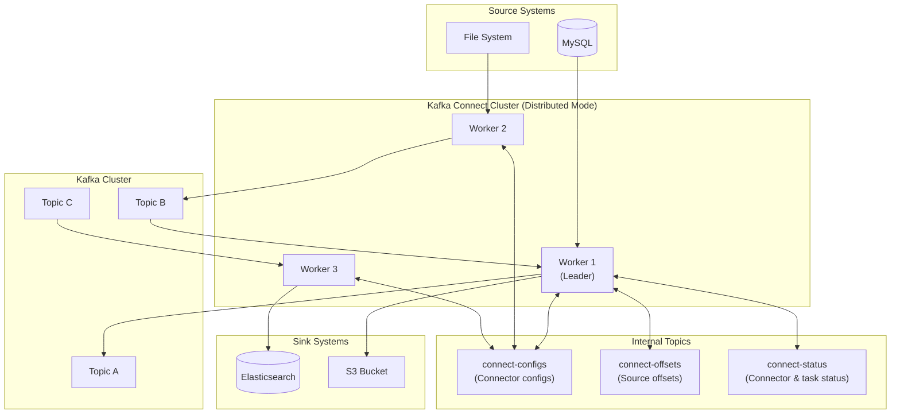
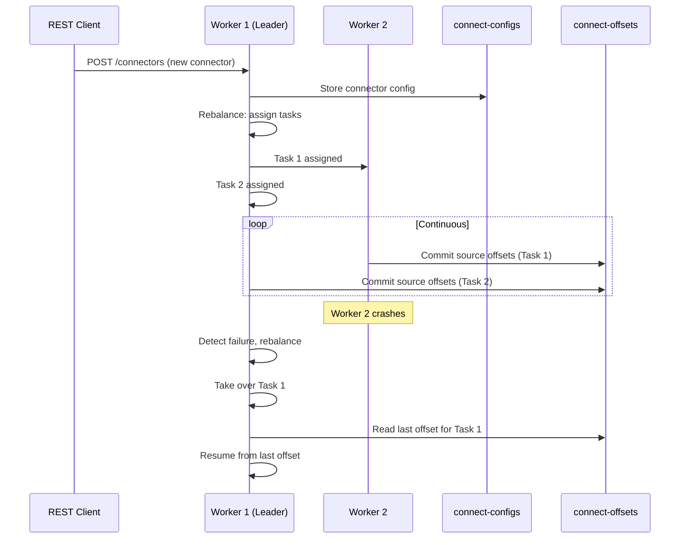
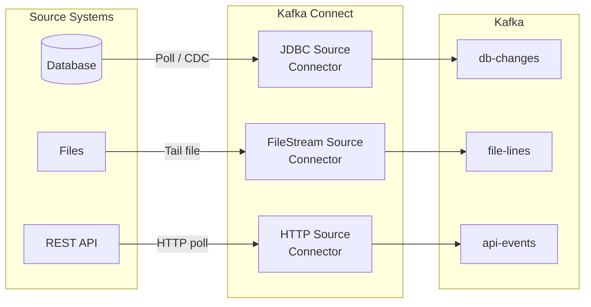
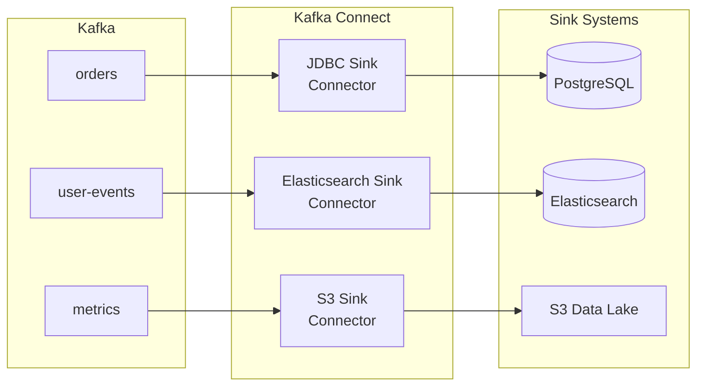
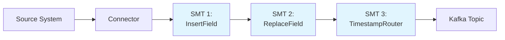

# Module 4: Kafka Connect

## Overview

Kafka Connect is the **integration framework** of the Apache Kafka ecosystem. Think of it as the **bridge** between Kafka and every other system in your data architecture. Instead of writing custom producer and consumer code for every database, file system, cloud service, or search engine, Kafka Connect provides a standardized, scalable, and fault-tolerant way to move data **in** and **out** of Kafka.

> **Analogy:** If Kafka is a highway for data, Kafka Connect is the set of on-ramps and off-ramps that let data enter from source systems and exit to destination systems -- without you having to build each ramp by hand.

---

## Table of Contents

1. [What is Kafka Connect?](#what-is-kafka-connect)
2. [Architecture](#architecture)
3. [Source vs Sink Connectors](#source-vs-sink-connectors)
4. [Connector Configuration Deep Dive](#connector-configuration-deep-dive)
5. [Single Message Transforms (SMTs)](#single-message-transforms-smts)
6. [Error Handling](#error-handling)
7. [Converters](#converters)
8. [REST API](#rest-api)
9. [Key Takeaways](#key-takeaways)
10. [Next Steps](#next-steps)

---

## What is Kafka Connect?

Kafka Connect is a tool for scalably and reliably streaming data between Apache Kafka and other systems. It solves the **N x M integration problem**: instead of building dedicated pipelines between every pair of systems, each system only needs one connector to Kafka.

### Without Kafka Connect

```
System A ----> System B
System A ----> System C
System B ----> System C
System B ----> System D
... (N x M integrations)
```

### With Kafka Connect

```
System A ---> Kafka <--- System B
System C ---> Kafka <--- System D
              Kafka ---> System E
              Kafka ---> System F
... (N + M integrations)
```

### Key Benefits

| Benefit | Description |
|---------|-------------|
| **Standardized** | Common framework and configuration model for all connectors |
| **Scalable** | Distributed mode supports horizontal scaling across multiple workers |
| **Fault-tolerant** | Automatic rebalancing when workers fail |
| **Declarative** | Configure connectors via JSON -- no code required |
| **Reusable** | Hundreds of community and commercial connectors available |

---

## Architecture

### Architecture Overview



### Core Components

#### Workers

A **worker** is a JVM process that executes connectors and tasks. There are two deployment modes:

| Feature | Standalone Mode | Distributed Mode |
|---------|----------------|-----------------|
| Workers | Single process | Multiple processes in a cluster |
| Config storage | Local file | Internal Kafka topics |
| Offset storage | Local file | Internal Kafka topics |
| Fault tolerance | None | Automatic rebalancing |
| Use case | Development, testing | Production |
| Scaling | Vertical only | Horizontal |

#### Connectors

A **connector** is a logical job that coordinates data streaming. It defines:
- Which system to connect to
- How to connect (credentials, endpoints)
- What data to move
- How many **tasks** to create

#### Tasks

A **task** is the unit of work. A single connector can spawn multiple tasks for parallelism. For example, a JDBC source connector reading from 4 tables might create 4 tasks, one per table.

### Distributed Mode Deep Dive



---

## Source vs Sink Connectors

### Source Connectors

Source connectors **pull data from external systems into Kafka topics**.



**Common source connectors:**
- **JDBC Source** -- reads rows from relational databases
- **Debezium** -- captures Change Data Capture (CDC) events
- **FileStream Source** -- reads lines from files
- **S3 Source** -- reads objects from Amazon S3
- **MongoDB Source** -- captures changes from MongoDB

### Sink Connectors

Sink connectors **push data from Kafka topics into external systems**.



**Common sink connectors:**
- **JDBC Sink** -- writes to relational databases
- **Elasticsearch Sink** -- indexes documents for search
- **S3 Sink** -- writes files to Amazon S3 (Parquet, Avro, JSON)
- **HDFS Sink** -- writes to Hadoop Distributed File System
- **BigQuery Sink** -- loads data into Google BigQuery

---

## Connector Configuration Deep Dive

Every connector is configured with a JSON document submitted via the REST API. Here is the anatomy of a connector configuration:

### Required Fields

```json
{
  "name": "my-connector",
  "config": {
    "connector.class": "io.confluent.connect.jdbc.JdbcSourceConnector",
    "tasks.max": "3",
    "key.converter": "org.apache.kafka.connect.storage.StringConverter",
    "value.converter": "io.confluent.connect.avro.AvroConverter",
    "value.converter.schema.registry.url": "http://schema-registry:8081"
  }
}
```

| Field | Description |
|-------|-------------|
| `name` | Unique name for this connector instance |
| `connector.class` | Fully qualified Java class of the connector |
| `tasks.max` | Maximum number of tasks to create |
| `key.converter` | Serializer/deserializer for record keys |
| `value.converter` | Serializer/deserializer for record values |

### JDBC Source Connector Fields

```json
{
  "connection.url": "jdbc:mysql://mysql:3306/mydb",
  "connection.user": "connect_user",
  "connection.password": "connect_pass",
  "mode": "incrementing",
  "incrementing.column.name": "id",
  "topic.prefix": "mysql-",
  "table.whitelist": "employees,departments",
  "poll.interval.ms": "5000"
}
```

| Field | Description |
|-------|-------------|
| `connection.url` | JDBC connection string |
| `mode` | How to detect new rows: `bulk`, `incrementing`, `timestamp`, `timestamp+incrementing` |
| `incrementing.column.name` | Column used for incrementing mode |
| `topic.prefix` | Prefix for auto-generated topic names |
| `table.whitelist` | Comma-separated list of tables to include |
| `poll.interval.ms` | How often to poll for new data |

---

## Single Message Transforms (SMTs)

SMTs allow you to modify records **in-flight** as they pass through Kafka Connect, without writing custom code. They are lightweight, single-message operations applied in a chain.

### SMT Pipeline



### Common SMTs

| SMT | Purpose | Example Use Case |
|-----|---------|-----------------|
| `InsertField` | Add a field to the record | Add processing timestamp |
| `ReplaceField` | Rename, include, or exclude fields | Rename `emp_name` to `employee_name` |
| `MaskField` | Replace field value with a valid null | Mask PII like SSN or email |
| `TimestampRouter` | Modify topic name based on timestamp | Route to daily topics: `orders-20240115` |
| `RegexRouter` | Modify topic name with regex | Remove prefix from topic names |
| `Filter` | Drop records that match a predicate | Drop records where `status = 'deleted'` |
| `ValueToKey` | Copy fields from value to key | Use `customer_id` as the record key |
| `ExtractField` | Extract a single field from a struct | Pull just the `payload` field |
| `Flatten` | Flatten nested structs | Convert `address.city` to `address_city` |
| `Cast` | Change field data type | Cast `price` from string to float |

### SMT Configuration Example

```json
{
  "transforms": "addTimestamp,renameField,routeByDate",
  "transforms.addTimestamp.type": "org.apache.kafka.connect.transforms.InsertField$Value",
  "transforms.addTimestamp.timestamp.field": "processed_at",
  "transforms.renameField.type": "org.apache.kafka.connect.transforms.ReplaceField$Value",
  "transforms.renameField.renames": "emp_name:employee_name",
  "transforms.routeByDate.type": "org.apache.kafka.connect.transforms.TimestampRouter",
  "transforms.routeByDate.topic.format": "${topic}-${timestamp}",
  "transforms.routeByDate.timestamp.format": "yyyyMMdd"
}
```

---

## Error Handling

Kafka Connect provides robust error handling to prevent a single bad record from halting the entire pipeline.

### Error Tolerance

| Setting | Behavior |
|---------|----------|
| `errors.tolerance=none` | (Default) Fail the task on the first error |
| `errors.tolerance=all` | Skip bad records and continue processing |

### Dead Letter Queue (DLQ)

When `errors.tolerance=all`, bad records can be routed to a **dead letter queue** topic for later analysis.

```json
{
  "errors.tolerance": "all",
  "errors.deadletterqueue.topic.name": "my-connector-dlq",
  "errors.deadletterqueue.topic.replication.factor": "1",
  "errors.deadletterqueue.context.headers.enable": "true",
  "errors.log.enable": "true",
  "errors.log.include.messages": "true"
}
```

**Key fields in DLQ headers:**
- `__connect.errors.topic` -- original topic
- `__connect.errors.exception.class` -- Java exception type
- `__connect.errors.exception.message` -- error description

---

## Converters

Converters control how data is **serialized** (written to Kafka) and **deserialized** (read from Kafka). They sit between the connector and Kafka.

```
Source System --> Connector --> Converter (serialize) --> Kafka
Kafka --> Converter (deserialize) --> Connector --> Sink System
```

### Common Converters

| Converter | Format | Schema? | Use Case |
|-----------|--------|---------|----------|
| `StringConverter` | Plain string | No | Simple text data |
| `JsonConverter` | JSON | Optional | General purpose, human-readable |
| `AvroConverter` | Avro binary | Yes (Schema Registry) | Production, strong typing |
| `ProtobufConverter` | Protobuf binary | Yes (Schema Registry) | gRPC-friendly systems |
| `ByteArrayConverter` | Raw bytes | No | Pass-through, custom formats |

### Configuring Converters

```json
{
  "key.converter": "org.apache.kafka.connect.storage.StringConverter",
  "value.converter": "io.confluent.connect.avro.AvroConverter",
  "value.converter.schema.registry.url": "http://schema-registry:8081",
  "value.converter.enhanced.avro.schema.support": "true"
}
```

> **Important:** `key.converter` and `value.converter` are configured **independently**. It is common to use `StringConverter` for keys and `AvroConverter` for values.

---

## REST API

Kafka Connect exposes a REST API for managing connectors. By default it listens on port **8083**.

### Endpoints

| Method | Endpoint | Description |
|--------|----------|-------------|
| `GET` | `/` | Get Connect worker info |
| `GET` | `/connectors` | List all connectors |
| `POST` | `/connectors` | Create a new connector |
| `GET` | `/connectors/{name}` | Get connector config |
| `GET` | `/connectors/{name}/status` | Get connector & task status |
| `PUT` | `/connectors/{name}/config` | Update connector config |
| `PUT` | `/connectors/{name}/pause` | Pause a connector |
| `PUT` | `/connectors/{name}/resume` | Resume a paused connector |
| `POST` | `/connectors/{name}/restart` | Restart a connector |
| `DELETE` | `/connectors/{name}` | Delete a connector |
| `GET` | `/connector-plugins` | List installed connector plugins |

### Example: Create a Connector

```bash
curl -X POST http://localhost:8083/connectors \
  -H "Content-Type: application/json" \
  -d '{
    "name": "my-source",
    "config": {
      "connector.class": "FileStreamSource",
      "tasks.max": "1",
      "file": "/tmp/input.txt",
      "topic": "file-topic"
    }
  }'
```

### Example: Check Status

```bash
curl -s http://localhost:8083/connectors/my-source/status | jq .
```

Response:
```json
{
  "name": "my-source",
  "connector": {
    "state": "RUNNING",
    "worker_id": "connect:8083"
  },
  "tasks": [
    {
      "id": 0,
      "state": "RUNNING",
      "worker_id": "connect:8083"
    }
  ]
}
```

---

## Key Takeaways

1. **Kafka Connect is declarative** -- you configure connectors with JSON, no code required.
2. **Source connectors** pull data into Kafka; **sink connectors** push data out of Kafka.
3. **Distributed mode** provides fault tolerance, scalability, and is the standard for production.
4. **SMTs** let you transform records in-flight without custom code.
5. **Dead letter queues** capture bad records so a single error does not halt your pipeline.
6. **Converters** control serialization format -- choose based on your schema management needs.
7. The **REST API** on port 8083 is the primary interface for managing connectors.
8. **Tasks** are the unit of parallelism -- increase `tasks.max` to scale throughput.
9. Always use **Schema Registry** with Avro or Protobuf converters in production.
10. Internal topics (`connect-configs`, `connect-offsets`, `connect-status`) store cluster state in distributed mode.

---

## Next Steps

Continue to **[Module 5: Change Data Capture with Debezium](../module-05-cdc-debezium/README.md)** to learn how to capture real-time database changes using CDC and stream them through Kafka.
