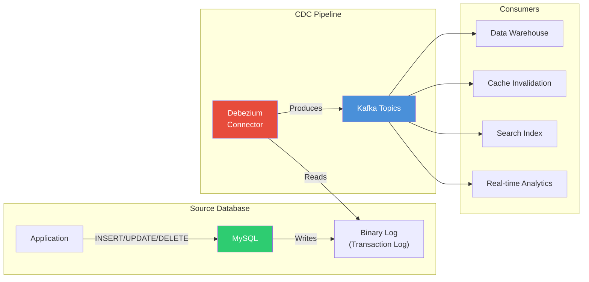
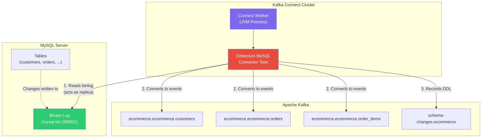
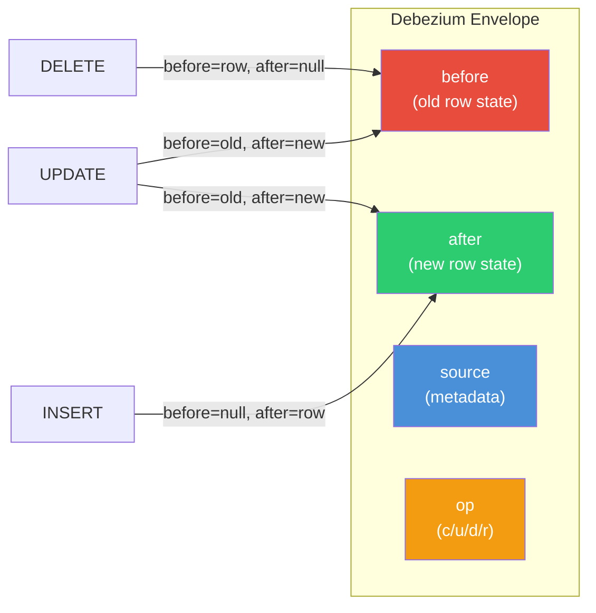
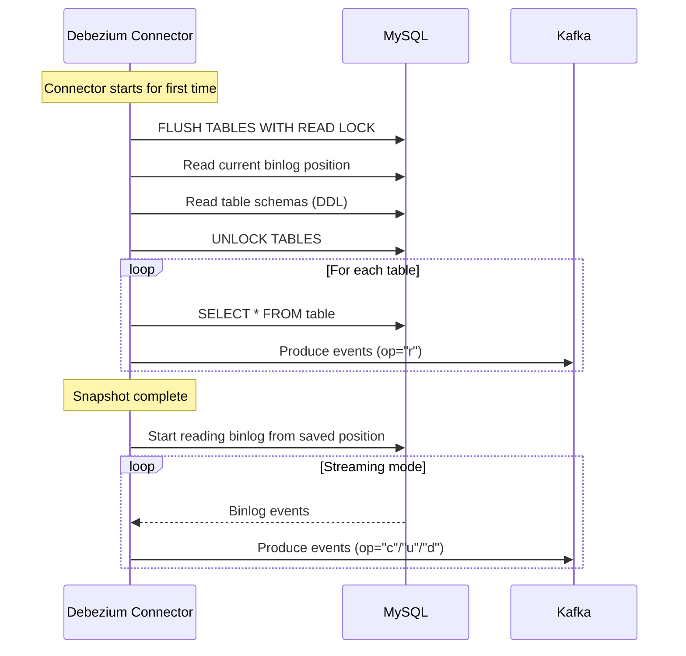
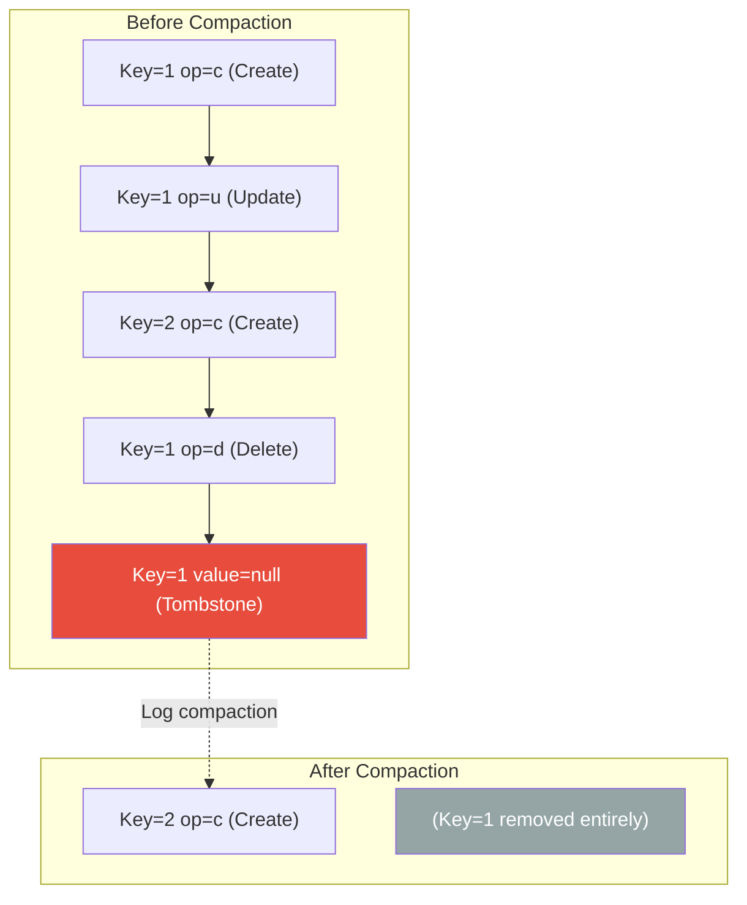

# Module 05 -- Change Data Capture with Debezium

## Table of Contents

1. [What is Change Data Capture?](#what-is-change-data-capture)
2. [CDC Approaches](#cdc-approaches)
3. [MySQL Binary Log Deep Dive](#mysql-binary-log-deep-dive)
4. [Debezium Architecture](#debezium-architecture)
5. [Debezium Event Structure](#debezium-event-structure)
6. [Operations](#operations)
7. [Snapshotting](#snapshotting)
8. [Schema History Topic](#schema-history-topic)
9. [Handling Schema Changes](#handling-schema-changes)
10. [Tombstone Events and Log Compaction](#tombstone-events-and-log-compaction)
11. [Hands-On Lab](#hands-on-lab)
12. [Key Takeaways](#key-takeaways)
13. [Next Module](#next-module)

---

## What is Change Data Capture?

Imagine you install a security camera at the entrance of a warehouse. The camera does not care what is inside the warehouse at any given moment -- it simply records every person who walks in or out, every delivery truck that arrives, every item that is moved. If you review the footage from the beginning, you can reconstruct the complete state of the warehouse at any point in time.

**Change Data Capture (CDC)** works exactly the same way for databases. Instead of querying the current state of a table ("What does the warehouse look like right now?"), CDC captures a continuous stream of every change -- every INSERT, UPDATE, and DELETE -- as it happens. This gives you:

- **Real-time replication** -- stream changes to downstream systems with sub-second latency
- **Event-driven architectures** -- react to database changes as events
- **Audit trails** -- know exactly what changed, when, and what the data looked like before and after
- **Zero-impact on the source** -- log-based CDC reads the database transaction log, not the tables themselves



---

## CDC Approaches

There are three main approaches to implementing Change Data Capture. Each has distinct trade-offs.

| Aspect | Log-Based CDC | Query-Based CDC | Trigger-Based CDC |
|--------|--------------|-----------------|-------------------|
| **How it works** | Reads the database transaction log (binlog, WAL) | Periodically polls tables using SQL queries with a timestamp or version column | Database triggers fire on INSERT/UPDATE/DELETE and write changes to a shadow table |
| **Latency** | Sub-second (real-time) | Seconds to minutes (poll interval) | Near real-time (trigger fires immediately) |
| **Impact on source DB** | Minimal (reads log files) | Moderate (runs queries against live tables) | High (trigger executes inside every transaction) |
| **Captures DELETEs?** | Yes | No (deleted rows disappear) | Yes |
| **Captures before-state?** | Yes (old + new row values) | No (only current state) | Yes (OLD and NEW in trigger) |
| **Schema changes** | Detected automatically | Must adapt queries manually | Must update triggers manually |
| **Requires source changes?** | No (just enable logging) | Yes (needs timestamp/version column) | Yes (must create triggers) |
| **Example tools** | Debezium, Maxwell, Canal | Kafka Connect JDBC Source | Custom implementation |

**Log-based CDC is the gold standard** for production streaming pipelines. It is non-invasive, captures all operations including deletes, and provides both the before and after state of every row. This is why Debezium uses log-based CDC.

---

## MySQL Binary Log Deep Dive

MySQL's **binary log (binlog)** is a sequential record of every data modification made to the server. It was originally designed for replication -- allowing replica servers to replay the same changes -- but it is also the foundation for log-based CDC.

### How the Binlog Works

1. A client issues an `INSERT`, `UPDATE`, or `DELETE` statement.
2. MySQL writes the change to the **redo log** (InnoDB) and then to the **binlog**.
3. The binlog is organized into numbered files (`mysql-bin.000001`, `mysql-bin.000002`, ...).
4. Each file contains a sequence of **events** with metadata: timestamp, server ID, position, etc.
5. A **binlog position** (file name + byte offset) uniquely identifies a point in time.

### Row-Based vs Statement-Based Logging

| Feature | ROW-Based (Required for CDC) | STATEMENT-Based |
|---------|------------------------------|-----------------|
| What is logged | The actual row data before and after the change | The SQL statement itself |
| Deterministic | Always (exact row values) | Not always (e.g., `NOW()`, `RAND()`) |
| Log size | Larger (full row data) | Smaller (just the SQL text) |
| CDC compatible | Yes -- Debezium requires this | No -- cannot reliably extract row-level changes |

**Debezium requires `binlog_format = ROW`**. The `debezium/example-mysql` Docker image comes pre-configured with this setting.

### Key MySQL Configuration for CDC

```ini
[mysqld]
server-id         = 1
log_bin           = mysql-bin
binlog_format     = ROW
binlog_row_image  = FULL
expire_logs_days  = 3
```

- `server-id` -- unique identifier; required for binlog to be enabled.
- `binlog_format = ROW` -- logs actual row changes, not SQL statements.
- `binlog_row_image = FULL` -- logs all columns in before/after images (not just changed ones).
- `expire_logs_days` -- how long to keep old binlog files.

---

## Debezium Architecture

Debezium is an open-source distributed platform for CDC. It runs as a **Kafka Connect source connector**, which means it plugs into the Kafka Connect framework you learned in Module 04.



### How Debezium Reads the Binlog

1. **Connects as a MySQL replica** -- Debezium's connector task opens a replication connection to MySQL, just like a read replica would.
2. **Reads events sequentially** -- It processes binlog events in order, converting each row-level change into a Kafka message.
3. **Tracks position** -- The connector stores its current binlog position (file + offset) in a Kafka offset topic, so it can resume after a restart.
4. **One topic per table** -- Each table gets its own Kafka topic, named `{server-name}.{database}.{table}`.

### Connector Components

| Component | Purpose |
|-----------|---------|
| **Connector** | Top-level configuration that defines the MySQL connection, table filters, and serialization settings |
| **Task** | The actual worker that reads the binlog and produces messages; connectors with `tasks.max=1` run a single task |
| **Offset Storage** | Kafka topic (or file in standalone mode) that stores the binlog position |
| **Schema History** | Kafka topic that stores DDL statements so the connector can reconstruct table schemas after restart |

---

## Debezium Event Structure

Every message Debezium produces follows the **envelope** format. The key identifies the row (primary key), and the value contains the full change event.

### Message Key

The key contains the primary key column(s) of the changed row:

```json
{
  "schema": {
    "type": "struct",
    "fields": [
      {
        "type": "int32",
        "optional": false,
        "field": "id"
      }
    ],
    "optional": false,
    "name": "ecommerce.ecommerce.customers.Key"
  },
  "payload": {
    "id": 1
  }
}
```

### Message Value (Envelope)

The value wraps the change in an **envelope** with four key fields:

```json
{
  "schema": { "...": "schema definition for the envelope" },
  "payload": {
    "before": {
      "id": 1,
      "email": "john@example.com",
      "first_name": "John",
      "last_name": "Doe",
      "phone": "555-0101",
      "created_at": "2024-01-15T10:30:00Z",
      "updated_at": "2024-01-15T10:30:00Z"
    },
    "after": {
      "id": 1,
      "email": "john.doe@newdomain.com",
      "first_name": "John",
      "last_name": "Doe",
      "phone": "555-0101",
      "created_at": "2024-01-15T10:30:00Z",
      "updated_at": "2024-03-20T14:22:00Z"
    },
    "source": {
      "version": "2.4.0.Final",
      "connector": "mysql",
      "name": "ecommerce",
      "ts_ms": 1710943320000,
      "snapshot": "false",
      "db": "ecommerce",
      "sequence": null,
      "table": "customers",
      "server_id": 1,
      "gtid": null,
      "file": "mysql-bin.000003",
      "pos": 1234,
      "row": 0,
      "thread": 42,
      "query": null
    },
    "op": "u",
    "ts_ms": 1710943320500,
    "transaction": null
  }
}
```

### Envelope Fields Explained

| Field | Description |
|-------|-------------|
| `before` | The row state **before** the change. `null` for inserts. |
| `after` | The row state **after** the change. `null` for deletes. |
| `source` | Metadata about where the change came from: database, table, binlog file/position, timestamp. |
| `op` | The operation type: `c` (create), `u` (update), `d` (delete), `r` (read/snapshot). |
| `ts_ms` | Timestamp when Debezium processed the event (not when the DB change happened -- see `source.ts_ms` for that). |
| `transaction` | Transaction metadata (if enabled). |



---

## Operations

Debezium uses single-character operation codes to classify each event.

### Create (`c`)

A new row was inserted. `before` is `null`, `after` contains the new row.

```json
{
  "before": null,
  "after": {
    "id": 6,
    "email": "alice@example.com",
    "first_name": "Alice",
    "last_name": "Wonder"
  },
  "op": "c"
}
```

### Update (`u`)

An existing row was modified. Both `before` and `after` are present.

```json
{
  "before": {
    "id": 6,
    "email": "alice@example.com",
    "first_name": "Alice",
    "last_name": "Wonder"
  },
  "after": {
    "id": 6,
    "email": "alice.wonder@newmail.com",
    "first_name": "Alice",
    "last_name": "Wonder"
  },
  "op": "u"
}
```

### Delete (`d`)

A row was deleted. `before` contains the deleted row, `after` is `null`.

```json
{
  "before": {
    "id": 6,
    "email": "alice.wonder@newmail.com",
    "first_name": "Alice",
    "last_name": "Wonder"
  },
  "after": null,
  "op": "d"
}
```

### Read / Snapshot (`r`)

During the initial snapshot (see below), existing rows are emitted with `op: "r"`. `before` is `null`, `after` contains the row.

```json
{
  "before": null,
  "after": {
    "id": 1,
    "email": "john@example.com",
    "first_name": "John",
    "last_name": "Doe"
  },
  "op": "r"
}
```

---

## Snapshotting

When a Debezium connector starts for the first time (or when certain conditions are met), it performs an **initial snapshot** -- reading the entire current state of the monitored tables before switching to streaming mode.

### Why Snapshot?

The binlog only retains a limited history (controlled by `expire_logs_days`). If the connector has never run, it does not know the existing data in the tables. The snapshot bootstraps the connector with the current state.

### Snapshot Process



### Snapshot Modes

| Mode | Behavior |
|------|----------|
| `initial` (default) | Snapshot on first startup only; then stream |
| `initial_only` | Take a snapshot and then stop (no streaming) |
| `when_needed` | Snapshot if offsets are missing or binlog position is unavailable |
| `never` | Skip snapshot entirely; start streaming from current binlog position |
| `schema_only` | Capture table schemas but not the data; then stream |
| `schema_only_recovery` | Re-read schemas without re-snapshotting data; for recovery after schema history loss |

---

## Schema History Topic

Debezium needs to understand the schema of each table to serialize row changes correctly. The problem: MySQL binlog events do not include column names or types -- they just contain raw column values in order.

### Why It Exists

- Debezium must map binlog row data to named, typed fields.
- Table schemas change over time (`ALTER TABLE`), so the connector needs to track the schema at every point in the binlog.
- The **schema history topic** stores every DDL statement along with the binlog position where it occurred.

### How It Works

1. During the snapshot, Debezium reads `SHOW CREATE TABLE` for every monitored table and writes the DDL to the schema history topic.
2. When the connector encounters an `ALTER TABLE` in the binlog, it records the DDL in the schema history topic.
3. On restart, the connector replays the schema history topic from the beginning to reconstruct the table schemas at the current binlog position.

The topic name is configured via `schema.history.internal.kafka.topic` (e.g., `schema-changes.ecommerce`).

---

## Handling Schema Changes

Schema evolution is inevitable in production databases. Debezium handles common DDL changes automatically:

| Change | Debezium Behavior |
|--------|-------------------|
| **Add column** | New column appears in `after`; old events (before the ALTER) have `null` for the new field |
| **Drop column** | Column disappears from `after`; Debezium logs a warning |
| **Rename column** | Treated as drop old + add new |
| **Change column type** | Debezium adapts the serialized type; may require Schema Registry compatibility checks |
| **Rename table** | Old topic stops receiving events; new topic starts |

### Best Practices for Schema Changes with CDC

1. **Use backward-compatible changes** -- add columns with defaults rather than dropping or renaming.
2. **Coordinate with Schema Registry** -- if using Avro serialization, schema compatibility settings will enforce safe evolution.
3. **Monitor the connector** -- schema changes can temporarily stall the connector; watch the Connect logs.
4. **Test DDL changes** in a staging environment with CDC running before applying to production.

---

## Tombstone Events and Log Compaction

### What Are Tombstone Events?

After emitting a `delete` event (with `before` containing the deleted row and `after` set to `null`), Debezium emits a second event called a **tombstone**: a message with the same key but a `null` value.

```
Key:   {"id": 6}
Value: null     <-- This is the tombstone
```

### Why Tombstones Matter

Kafka topics can be configured with **log compaction**, which retains only the latest message for each key. Without tombstones, the last message for a deleted row would be the delete event -- the row would still appear (marked as deleted) in any consumer that replays the compacted topic.

A tombstone tells the log compactor: "This key is gone. Remove it entirely."



---

## Hands-On Lab

### Prerequisites

- Docker Desktop running with at least 8 GB RAM allocated
- Python 3.9+ with a virtual environment

### Quick Start

```bash
# 1. Navigate to this module
cd module-05-cdc-debezium

# 2. Create and activate virtual environment
python3 -m venv .venv
source .venv/bin/activate
pip install -r requirements.txt

# 3. Start the infrastructure
docker compose up -d

# 4. Wait for services and register the connector
python src/register_connector.py

# 5. Trigger some database changes
python src/trigger_changes.py

# 6. Watch the CDC events
python src/cdc_consumer.py
```

Or run everything at once with the demo script:

```bash
chmod +x src/setup_and_demo.sh
./src/setup_and_demo.sh
```

### What You Will See

1. **Snapshot events** (`op=r`) for the seed data already in the database.
2. **Insert events** (`op=c`) as `trigger_changes.py` adds new customers and orders.
3. **Update events** (`op=u`) as order statuses change, showing before and after states.
4. **Delete events** (`op=d`) as test records are removed.

### Services

| Service | URL | Purpose |
|---------|-----|---------|
| Kafka UI | http://localhost:8080 | Browse topics, view messages |
| Kafka Connect REST | http://localhost:8083 | Manage connectors |
| MySQL | localhost:3306 | Source database (user: root, pass: debezium) |
| Schema Registry | http://localhost:8081 | Schema management |

### Exercises

Work through the exercises in the `exercises/` directory:
- [01-basic-cdc.md](exercises/01-basic-cdc.md) -- Setting up CDC and reading events
- [02-advanced-cdc.md](exercises/02-advanced-cdc.md) -- Filtering, transforms, and schema evolution

Check your solutions against `solutions/`.

---

## Key Takeaways

1. **CDC captures every change** as it happens -- inserts, updates, and deletes -- without impacting the source database.
2. **Log-based CDC** (Debezium's approach) reads the database transaction log and is the least invasive method.
3. **Debezium runs as a Kafka Connect connector**, producing one topic per table with a structured envelope format.
4. The **envelope** contains `before`, `after`, `source`, and `op` fields -- giving you complete change context.
5. **Snapshotting** bootstraps the connector with existing data before switching to real-time streaming.
6. The **schema history topic** lets Debezium track DDL changes and reconstruct table schemas after restarts.
7. **Tombstone events** enable proper log compaction by signaling that a key has been deleted.
8. Schema changes require care -- prefer backward-compatible changes and coordinate with Schema Registry.

---

## Next Module

In [Module 06 -- ksqlDB](../module-06-ksqldb/), you will learn how to process CDC streams using SQL. You will create streaming queries that react to the change events produced by Debezium, build materialized views, and perform windowed aggregations -- all without writing a single line of Java or Python.
