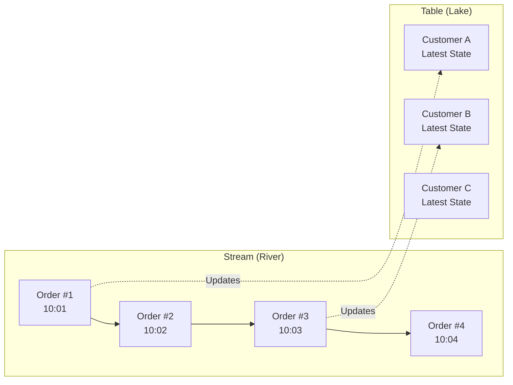
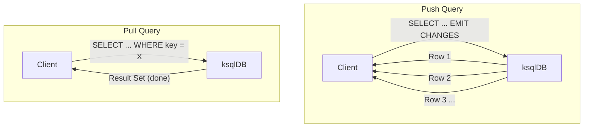
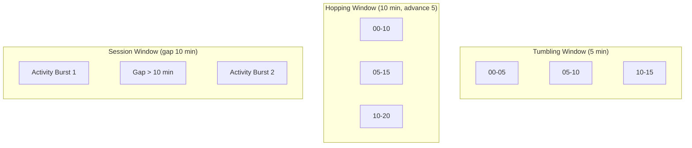
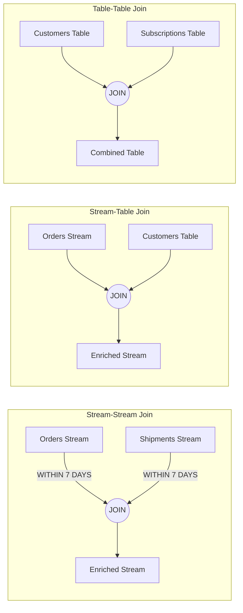
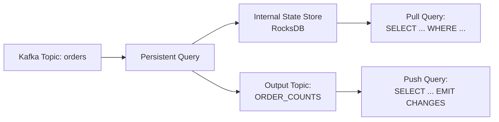

# Module 6: ksqlDB -- Streaming SQL for Apache Kafka

## Table of Contents

1. [What is ksqlDB?](#what-is-ksqldb)
2. [Streams vs Tables](#streams-vs-tables)
3. [Creating Streams and Tables](#creating-streams-and-tables)
4. [Querying: Push vs Pull](#querying-push-vs-pull)
5. [Windowing](#windowing)
6. [Aggregations](#aggregations)
7. [Joins](#joins)
8. [Materialized Views and Persistent Queries](#materialized-views-and-persistent-queries)
9. [User-Defined Functions (UDFs)](#user-defined-functions-udfs)
10. [ksqlDB and Kafka Connect Integration](#ksqldb-and-kafka-connect-integration)
11. [Hands-On Lab](#hands-on-lab)
12. [Key Takeaways](#key-takeaways)

---

## What is ksqlDB?

ksqlDB is a **streaming database** built on top of Apache Kafka. Think of it as
**SQL for real-time data streams**. Instead of writing Java or Python consumer
applications to process Kafka messages, you write familiar SQL statements and
ksqlDB handles the heavy lifting -- consumer groups, state stores, fault
tolerance, and exactly-once semantics.

| Traditional Approach | ksqlDB Approach |
|---|---|
| Write a Kafka consumer in Java/Python | Write a SQL query |
| Manage state stores manually | Automatic state management |
| Build, package, deploy an application | Submit a query via REST or CLI |
| Handle rebalancing, fault tolerance | Built-in HA and exactly-once |

**Analogy:** If Kafka is a highway for data, ksqlDB is the **traffic control
center** where you can filter, route, aggregate, and join data flows using
nothing but SQL.

```
┌─────────────────────────────────────────────────────┐
│                     ksqlDB                          │
│                                                     │
│   SQL Interface ──> Stream Processing Engine        │
│         │                    │                       │
│         v                    v                       │
│   CREATE STREAM ...    Kafka Streams (under hood)   │
│   SELECT ... EMIT      RocksDB state stores         │
│                                                     │
│         Reads from / Writes to Kafka Topics         │
└─────────────────────────────────────────────────────┘
```

---

## Streams vs Tables

This is the **single most important concept** in ksqlDB. Understanding the
difference unlocks everything else.

### The River vs Lake Analogy

- **Stream = River**: Data flows past continuously. Each event is immutable and
  append-only. You observe events as they arrive. A stream of `orders` means
  every new order is a new row -- even if the same customer orders again.

- **Table = Lake**: Data accumulates and **updates in place**. A table is a
  changelog -- if customer `C001` changes their email, the table reflects the
  *latest* state. Old values are replaced.

| Property | Stream | Table |
|---|---|---|
| Mental model | Append-only log | Changelog / latest state |
| Duplicates | Allowed (each event is unique) | Deduplicated by key |
| Use case | Events, facts, clicks, orders | Entities, lookups, profiles |
| Kafka analogy | Topic (log) | Compacted topic |



### Why Does This Matter?

When you run a `SELECT` on a **stream**, you get a continuous flow of results
(push query). When you run a `SELECT` on a **table**, you get a point-in-time
snapshot (pull query). Choosing the wrong abstraction leads to confusing results.

---

## Creating Streams and Tables

### Streams from Topics

```sql
CREATE STREAM orders_stream (
    order_id VARCHAR KEY,
    customer_id VARCHAR,
    product_id VARCHAR,
    quantity INT,
    price DOUBLE,
    order_timestamp VARCHAR
) WITH (
    KAFKA_TOPIC = 'orders',
    VALUE_FORMAT = 'JSON'
);
```

### Tables from Topics

```sql
CREATE TABLE customers_table (
    customer_id VARCHAR PRIMARY KEY,
    name VARCHAR,
    email VARCHAR,
    region VARCHAR
) WITH (
    KAFKA_TOPIC = 'customers',
    VALUE_FORMAT = 'JSON'
);
```

**Key differences in DDL:**
- Streams use `KEY` on a column; tables use `PRIMARY KEY`
- Tables require a primary key for upsert behavior
- Both reference an underlying Kafka topic via `KAFKA_TOPIC`

---

## Querying: Push vs Pull

ksqlDB supports two fundamentally different query modes:

### Push Queries (Continuous)

Push queries subscribe to a stream of changes and **never terminate** (until
cancelled). They use the `EMIT CHANGES` clause.

```sql
-- Continuously emit new orders as they arrive
SELECT order_id, customer_id, price
FROM orders_stream
EMIT CHANGES;
```

**Use cases:** Real-time dashboards, alerting systems, live monitoring.

### Pull Queries (Point-in-Time)

Pull queries return the **current state** of a materialized view or table, then
terminate -- just like a traditional SQL SELECT.

```sql
-- Get the current order count for a specific customer
SELECT customer_id, order_count
FROM customer_order_counts
WHERE customer_id = 'C001';
```

**Use cases:** REST API lookups, on-demand reporting, serving layer queries.



---

## Windowing

Windowing lets you group events by **time intervals**. ksqlDB supports three
window types.

### 1. Tumbling Windows

Fixed-size, non-overlapping, contiguous windows. Every event falls into exactly
one window.

```
Time ──────────────────────────────────────────────>
|  Window 1  |  Window 2  |  Window 3  |  Window 4  |
| 10:00-10:05| 10:05-10:10| 10:10-10:15| 10:15-10:20|
|  * * *     |  * *       |  * * * *   |  *         |
```

```sql
SELECT product_id,
       COUNT(*) AS order_count,
       SUM(price * quantity) AS total_revenue
FROM orders_stream
WINDOW TUMBLING (SIZE 5 MINUTES)
GROUP BY product_id
EMIT CHANGES;
```

### 2. Hopping Windows

Fixed-size windows that **overlap**. Defined by size and advance interval.
An event can belong to multiple windows.

```
Time ──────────────────────────────────────────────>
|---- Window 1 (10:00 - 10:10) -------|
          |---- Window 2 (10:05 - 10:15) -------|
                    |---- Window 3 (10:10 - 10:20) -------|
    Size = 10 min, Advance = 5 min
```

```sql
SELECT product_id,
       COUNT(*) AS order_count
FROM orders_stream
WINDOW HOPPING (SIZE 10 MINUTES, ADVANCE BY 5 MINUTES)
GROUP BY product_id
EMIT CHANGES;
```

### 3. Session Windows

Dynamic windows based on **activity gaps**. A session closes when no events
arrive within the inactivity gap. Each key has independent sessions.

```
Time ──────────────────────────────────────────────>
User A: |* * *  *|          (gap > 10 min)      |* *  *|
         Session 1                                Session 2

User B:      |* *     *  * * *|
              Session 1
```

```sql
SELECT user_id,
       COUNT(*) AS page_views,
       WINDOWSTART AS session_start,
       WINDOWEND AS session_end
FROM clickstream_stream
WINDOW SESSION (10 MINUTES)
GROUP BY user_id
EMIT CHANGES;
```



---

## Aggregations

ksqlDB supports standard SQL aggregation functions on streams and tables.

### COUNT, SUM, AVG

```sql
-- Orders per customer per hour
SELECT customer_id,
       COUNT(*) AS total_orders,
       SUM(price * quantity) AS total_spent,
       AVG(price) AS avg_price
FROM orders_stream
WINDOW TUMBLING (SIZE 1 HOUR)
GROUP BY customer_id
EMIT CHANGES;
```

### TOPK / TOPKDISTINCT

```sql
-- Top 3 most expensive orders per 5-minute window
SELECT TOPK(price, 3) AS top_prices
FROM orders_stream
WINDOW TUMBLING (SIZE 5 MINUTES)
GROUP BY product_id
EMIT CHANGES;
```

### GROUP BY

All aggregations in ksqlDB require `GROUP BY`. Unlike traditional SQL, you
cannot aggregate an entire stream without grouping -- every aggregation
produces a **table** (keyed by the group columns).

---

## Joins

ksqlDB supports three categories of joins, each with specific semantics.

### Stream-Stream Joins

Join two streams within a **time window**. Both sides are unbounded, so a window
is required to limit the join scope.

**Use case:** Correlate orders with shipments that happen within 7 days.

```sql
SELECT o.order_id,
       o.customer_id,
       s.tracking_number,
       s.shipped_at
FROM orders_stream o
INNER JOIN shipments_stream s
    WITHIN 7 DAYS
    ON o.order_id = s.order_id
EMIT CHANGES;
```

### Stream-Table Joins

Enrich a stream with lookup data from a table. The stream drives the join; the
table provides the latest state for each key.

**Use case:** Enrich orders with customer details.

```sql
SELECT o.order_id,
       o.customer_id,
       c.name AS customer_name,
       c.region,
       o.price
FROM orders_stream o
LEFT JOIN customers_table c
    ON o.customer_id = c.customer_id
EMIT CHANGES;
```

### Table-Table Joins

Join two tables by key. The result updates whenever either side changes.

**Use case:** Combine customer profiles with customer subscription status.

```sql
SELECT c.customer_id,
       c.name,
       s.plan_type,
       s.renewal_date
FROM customers_table c
INNER JOIN subscriptions_table s
    ON c.customer_id = s.customer_id
EMIT CHANGES;
```



---

## Materialized Views and Persistent Queries

### Persistent Queries

When you run a `CREATE STREAM AS SELECT` or `CREATE TABLE AS SELECT`, ksqlDB
creates a **persistent query** -- a continuously running Kafka Streams
application that reads from input topics, processes data, and writes results to
an output topic.

```sql
-- This runs continuously in the background
CREATE TABLE order_counts AS
SELECT customer_id,
       COUNT(*) AS total_orders
FROM orders_stream
GROUP BY customer_id
EMIT CHANGES;
```

### Materialized Views

Materialized views are the **result tables** of persistent queries. They
maintain the latest state and can be queried with pull queries.

```sql
-- Pull query against the materialized view
SELECT customer_id, total_orders
FROM order_counts
WHERE customer_id = 'C001';
```



### Managing Persistent Queries

```sql
-- List all running queries
SHOW QUERIES;

-- Describe a specific query
EXPLAIN <query_id>;

-- Terminate a query
TERMINATE <query_id>;
```

---

## User-Defined Functions (UDFs)

ksqlDB allows you to extend SQL with custom functions written in Java.

### Types of UDFs

| Type | Description | Example |
|---|---|---|
| **UDF** (Scalar) | One row in, one value out | `MASK_EMAIL('a@b.com')` -> `a***@b.com` |
| **UDAF** (Aggregate) | Many rows in, one value out | Custom weighted average |
| **UDTF** (Table) | One row in, many rows out | Explode a JSON array |

### Creating a UDF (Java)

```java
@UdfDescription(name = "mask_email",
                description = "Masks an email address")
public class MaskEmail {
    @Udf(description = "Mask the local part of an email")
    public String maskEmail(final String email) {
        if (email == null) return null;
        int at = email.indexOf('@');
        if (at <= 1) return email;
        return email.charAt(0) + "***" + email.substring(at);
    }
}
```

### Deploying UDFs

1. Package as a JAR file.
2. Place in the ksqlDB `ext/` directory.
3. Restart ksqlDB server.
4. Verify with `SHOW FUNCTIONS;`

---

## ksqlDB and Kafka Connect Integration

ksqlDB can manage Kafka Connect connectors directly via SQL -- no separate
Connect cluster configuration needed (when running in embedded mode).

### Creating a Source Connector

```sql
CREATE SOURCE CONNECTOR pg_source WITH (
    'connector.class' = 'io.debezium.connector.postgresql.PostgresConnector',
    'database.hostname' = 'postgres',
    'database.port' = '5432',
    'database.user' = 'myuser',
    'database.password' = 'mypass',
    'database.dbname' = 'mydb',
    'table.include.list' = 'public.orders',
    'topic.prefix' = 'pg'
);
```

### Creating a Sink Connector

```sql
CREATE SINK CONNECTOR es_sink WITH (
    'connector.class' = 'io.confluent.connect.elasticsearch.ElasticsearchSinkConnector',
    'connection.url' = 'http://elasticsearch:9200',
    'topics' = 'ORDER_COUNTS',
    'type.name' = '_doc',
    'key.ignore' = 'true'
);
```

### Managing Connectors

```sql
SHOW CONNECTORS;
DESCRIBE CONNECTOR pg_source;
DROP CONNECTOR pg_source;
```

---

## Hands-On Lab

### Prerequisites

```bash
docker compose up -d
```

### Step-by-Step

1. **Seed data:** `python src/seed_topics.py`
2. **Create schemas:** `bash src/setup_ksqldb.sh`
3. **Open ksqlDB CLI:** `docker exec -it ksqldb-cli ksql http://ksqldb-server:8088`
4. **Explore:**
   - Run push queries from `queries/03-aggregations.sql`
   - Run join queries from `queries/04-joins.sql`
   - Experiment with windowed aggregations
5. **Use the Python client:** `python src/ksqldb_client.py`

### Exercises

- [Exercise 1: Streams and Tables](exercises/01-streams-tables.md)
- [Exercise 2: Windowing](exercises/02-windowing.md)
- [Exercise 3: Joins](exercises/03-joins.md)

### Quiz

- [Module 6 Quiz](quiz.md)

---

## Key Takeaways

1. **ksqlDB is SQL for streams.** It lets you build stream processing
   applications without writing code in Java or Python.

2. **Streams are append-only; tables are changelog-based.** Choose the right
   abstraction for your data: events go in streams, entities go in tables.

3. **Push queries are continuous; pull queries are point-in-time.** Use push
   for real-time processing, pull for serving lookups.

4. **Windowing is essential for bounded aggregations.** Tumbling (fixed,
   non-overlapping), hopping (fixed, overlapping), and session (activity-based)
   windows each serve different use cases.

5. **Joins connect streams and tables.** Stream-stream joins require a time
   window; stream-table joins enrich events with lookup data.

6. **Persistent queries are long-running Kafka Streams apps.** `CREATE ... AS
   SELECT` deploys processing that survives restarts.

7. **Materialized views enable pull queries.** They maintain up-to-date state
   that can be queried like a traditional database.

8. **ksqlDB integrates with Kafka Connect.** You can create and manage
   connectors directly from SQL.

---

**Next:** [Module 7 -- Faust: Python Stream Processing](../module-07-faust-streaming/README.md)
