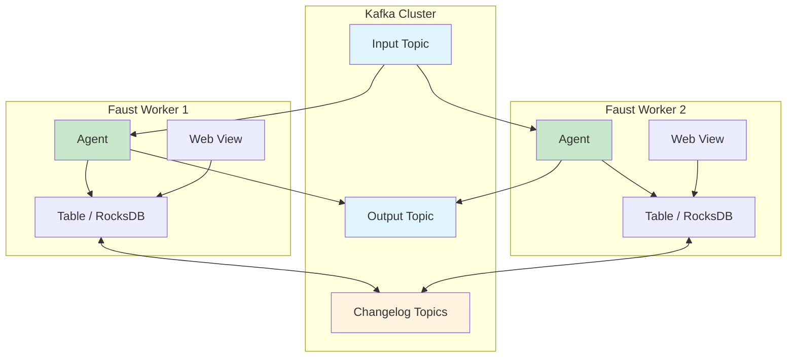
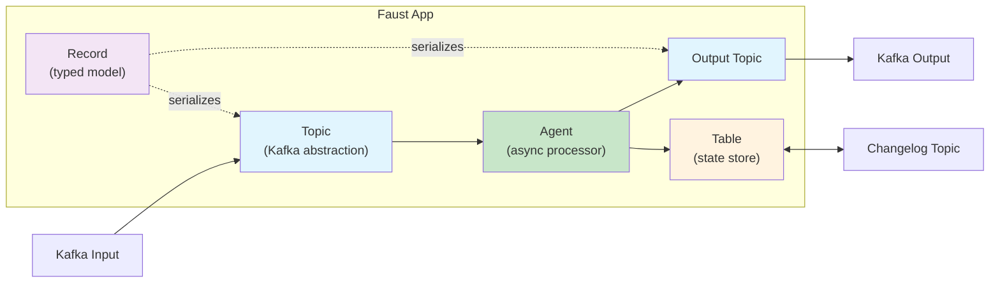
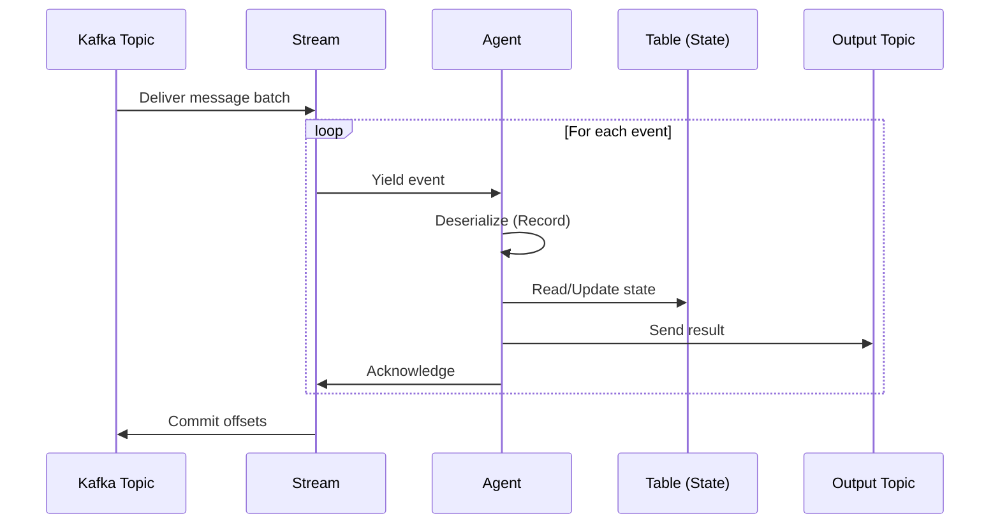
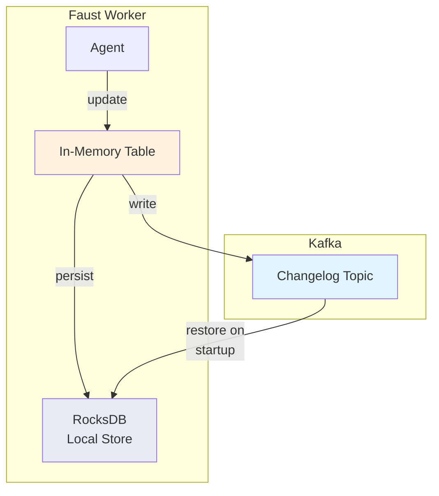

# Module 7: Stream Processing with Faust

## Table of Contents

1. [What is Faust?](#what-is-faust)
2. [Faust vs ksqlDB vs Flink](#faust-vs-ksqldb-vs-flink)
3. [Core Concepts](#core-concepts)
4. [Agents: Async Stream Processors](#agents-async-stream-processors)
5. [Tables: Distributed State Stores](#tables-distributed-state-stores)
6. [Records: Typed Models](#records-typed-models)
7. [Windowed Processing](#windowed-processing)
8. [Stateful Processing Patterns](#stateful-processing-patterns)
9. [Exactly-Once Semantics](#exactly-once-semantics)
10. [Web Views: Exposing State via HTTP](#web-views-exposing-state-via-http)
11. [Deployment and Scaling](#deployment-and-scaling)
12. [Key Takeaways](#key-takeaways)
13. [Next Steps](#next-steps)

---

## What is Faust?

**Faust** is a Python-native stream processing library inspired by Apache Kafka Streams. It allows you to build high-performance distributed systems and streaming data pipelines using pure Python with `async/await` syntax.

> **Important:** This module uses **`faust-streaming`**, the actively maintained community fork of the original `robinhood/faust` library. The original project by Robinhood is no longer maintained. Always install `faust-streaming`, not `faust`.

### Why Faust?

- **Pure Python** -- no JVM, no separate cluster to manage
- **Async/Await** -- built on Python's `asyncio` for high concurrency
- **Kafka Streams semantics** -- topics, tables, windowed aggregations, exactly-once processing
- **Type-safe models** -- Faust `Record` classes provide serialization/deserialization with type hints
- **Built-in web server** -- expose state and metrics via HTTP endpoints
- **RocksDB state backend** -- fast local state storage for tables and windowed aggregations
- **Horizontally scalable** -- add more worker instances to scale out

### Architecture Overview



---

## Faust vs ksqlDB vs Flink

| Feature | Faust | ksqlDB | Apache Flink |
|---|---|---|---|
| **Language** | Python | SQL | Java/Scala/Python/SQL |
| **Paradigm** | Programmatic (async/await) | Declarative (SQL) | Programmatic + SQL |
| **Infrastructure** | Embedded (no extra cluster) | Requires ksqlDB server | Requires Flink cluster (JobManager + TaskManagers) |
| **State Backend** | RocksDB (local) | RocksDB (on ksqlDB server) | RocksDB, heap, or pluggable |
| **Scaling** | Add more Python workers | Scale ksqlDB servers | Scale TaskManagers |
| **Windowing** | Tumbling, hopping | Tumbling, hopping, session | Tumbling, sliding, session, global |
| **Exactly-Once** | Yes (with idempotent producers) | Yes | Yes (with checkpointing) |
| **Web UI / HTTP** | Built-in web views | REST API | Flink Dashboard |
| **Learning Curve** | Low (if you know Python) | Low (if you know SQL) | Moderate to high |
| **Best For** | Python teams, microservices | Ad-hoc queries, simple transforms | Large-scale, complex event processing |
| **Maturity** | Community-maintained fork | Confluent-backed | Apache top-level project |

---

## Core Concepts

Faust has five core building blocks:

### 1. App

The `App` is the entry point. It represents your Faust application, manages configuration, and coordinates agents, topics, and tables.

```python
import faust

app = faust.App(
    'my-app',
    broker='kafka://localhost:9092',
    store='rocksdb://',       # State backend
    topic_partitions=4,       # Default partitions for new topics
)
```

### 2. Agent

An **Agent** is an async function that processes a stream of events from a topic. Agents are the workhorses of Faust -- each one subscribes to a topic and processes events as they arrive.

```python
@app.agent(input_topic)
async def process(stream):
    async for event in stream:
        # Process each event
        result = transform(event)
        await output_topic.send(value=result)
```

### 3. Topic

A **Topic** is a Faust abstraction over a Kafka topic. You declare topics with their key and value types for automatic serialization.

```python
orders_topic = app.topic('orders', value_type=Order)
```

### 4. Table

A **Table** is a distributed key-value store backed by a Kafka changelog topic and (optionally) RocksDB for local state. Tables enable stateful processing.

```python
order_count = app.Table('order-count', default=int)
```

### 5. Record

A **Record** is a typed model class (similar to a dataclass) that handles serialization and deserialization of messages.

```python
class Order(faust.Record):
    order_id: str
    customer_id: str
    amount: float
    product: str
```

### How They Fit Together



---

## Agents: Async Stream Processors

Agents are the core processing units in Faust. Each agent is an `async` generator function that iterates over a stream of events.

### Basic Agent

```python
@app.agent(orders_topic)
async def process_orders(stream):
    async for order in stream:
        print(f"Processing order {order.order_id}: ${order.amount}")
```

### Agent with Grouping

Agents can group events by key for partitioned processing:

```python
@app.agent(orders_topic)
async def count_by_customer(stream):
    async for order in stream.group_by(Order.customer_id):
        customer_orders[order.customer_id] += 1
```

### Agent with Concurrency

You can run multiple concurrent instances of an agent within a single worker:

```python
@app.agent(orders_topic, concurrency=4)
async def process_orders(stream):
    async for order in stream:
        await heavy_processing(order)
```

### Agent Processing Flow



---

## Tables: Distributed State Stores

Tables provide mutable, distributed state that persists across restarts. Under the hood, every table update is written to a Kafka changelog topic and to a local RocksDB store.

### Basic Table

```python
# Simple counter table
word_counts = app.Table('word-counts', default=int)

@app.agent(words_topic)
async def count_words(stream):
    async for word in stream:
        word_counts[word] += 1
```

### Table State Management



### Windowed Tables

Windowed tables track state within time windows:

```python
# Count events per key in 5-minute tumbling windows
page_views = app.Table(
    'page-views',
    default=int,
).tumbling(300)  # 300 seconds = 5 minutes

@app.agent(clicks_topic)
async def count_clicks(stream):
    async for click in stream:
        page_views[click.page_id] += 1
        # Access current window value
        current = page_views[click.page_id].current()
```

---

## Records: Typed Models

Faust Records provide schema definitions for your streaming data with automatic JSON serialization and deserialization.

### Defining Records

```python
import faust
from datetime import datetime

class Transaction(faust.Record):
    transaction_id: str
    user_id: str
    amount: float
    merchant: str
    country: str
    timestamp: datetime

class FraudAlert(faust.Record):
    transaction_id: str
    user_id: str
    reason: str
    risk_score: float
    flagged_at: datetime
```

### Records with Defaults and Validation

```python
class Order(faust.Record):
    order_id: str
    customer_id: str
    product_id: str
    quantity: int = 1
    amount: float = 0.0
    status: str = 'pending'
```

### Nested Records

```python
class Address(faust.Record):
    street: str
    city: str
    country: str

class Customer(faust.Record):
    customer_id: str
    name: str
    email: str
    address: Address
```

---

## Windowed Processing

Faust supports two types of windows for time-based aggregations.

### Tumbling Windows

Non-overlapping, fixed-size windows. Each event belongs to exactly one window.

```python
# 1-minute tumbling window
orders_per_minute = app.Table(
    'orders-per-minute',
    default=int,
).tumbling(60)  # 60 seconds

@app.agent(orders_topic)
async def track_orders(stream):
    async for order in stream:
        orders_per_minute['total'] += 1
        count = orders_per_minute['total'].current()
        print(f"Orders this minute: {count}")
```

### Hopping Windows

Overlapping windows with a fixed size and a hop interval. Events can belong to multiple windows.

```python
# 10-minute window, advancing every 1 minute
revenue = app.Table(
    'revenue',
    default=float,
).hopping(600, 60)  # size=600s, step=60s

@app.agent(orders_topic)
async def track_revenue(stream):
    async for order in stream:
        revenue[order.category] += order.amount
```

### Window Expiration

Old windows are automatically expired to free memory:

```python
orders_per_minute = app.Table(
    'orders-per-minute',
    default=int,
).tumbling(60, expires=timedelta(hours=1))
```

---

## Stateful Processing Patterns

### Counting

```python
event_counts = app.Table('event-counts', default=int)

@app.agent(events_topic)
async def count_events(stream):
    async for event in stream:
        event_counts[event.event_type] += 1
```

### Aggregating

```python
revenue_by_category = app.Table('revenue-by-category', default=float)

@app.agent(orders_topic)
async def aggregate_revenue(stream):
    async for order in stream:
        revenue_by_category[order.category] += order.amount
```

### Stream-Table Joins (Enrichment)

```python
customer_table = app.Table('customers', default=dict)

@app.agent(orders_topic)
async def enrich_orders(stream):
    async for order in stream:
        customer = customer_table.get(order.customer_id, {})
        enriched = EnrichedOrder(
            order_id=order.order_id,
            customer_name=customer.get('name', 'Unknown'),
            amount=order.amount,
        )
        await enriched_orders_topic.send(value=enriched)
```

### Deduplication

```python
seen_ids = app.Table('seen-ids', default=bool)

@app.agent(events_topic)
async def deduplicate(stream):
    async for event in stream:
        if not seen_ids.get(event.event_id):
            seen_ids[event.event_id] = True
            await deduplicated_topic.send(value=event)
```

---

## Exactly-Once Semantics

Faust supports exactly-once processing through a combination of:

1. **Idempotent Producers** -- Kafka producer config ensures no duplicate sends
2. **Transactional State** -- Table updates and offset commits happen atomically
3. **Changelog Topics** -- State is recoverable from Kafka

Enable exactly-once in your app configuration:

```python
app = faust.App(
    'my-app',
    broker='kafka://localhost:9092',
    processing_guarantee='exactly_once',
    store='rocksdb://',
)
```

> **Note:** Exactly-once requires Kafka broker version 0.11+ and adds some latency overhead due to transactional commits.

---

## Web Views: Exposing State via HTTP

Faust includes a built-in web server (based on `aiohttp`) that lets you expose table state and custom endpoints over HTTP.

### Basic Web View

```python
@app.page('/stats/')
async def stats_view(web, request):
    return web.json({
        'total_orders': order_count['total'],
        'active_users': len(active_users),
    })
```

### Table-Backed Views

```python
@app.page('/count/{key}/')
async def get_count(web, request, key):
    count = word_counts.get(key, 0)
    return web.json({'key': key, 'count': count})
```

### Running the Web Server

By default, the web server runs on port 6066:

```bash
faust -A myapp worker --web-port 6066
```

---

## Deployment and Scaling

### Running a Faust Worker

```bash
# Start a single worker
faust -A src.app_basic worker -l info

# Start with specific web port
faust -A src.app_basic worker -l info --web-port 6066
```

### Horizontal Scaling

Faust scales by running multiple worker instances. Kafka partitions are rebalanced across workers automatically.

```bash
# Terminal 1
faust -A myapp worker -l info --web-port 6066

# Terminal 2
faust -A myapp worker -l info --web-port 6067

# Terminal 3
faust -A myapp worker -l info --web-port 6068
```

Each worker processes a subset of partitions. When a worker joins or leaves, Kafka triggers a consumer group rebalance.

### Docker Deployment

```dockerfile
FROM python:3.11-slim
WORKDIR /app
COPY requirements.txt .
RUN pip install -r requirements.txt
COPY src/ ./src/
CMD ["faust", "-A", "src.app_basic", "worker", "-l", "info"]
```

### Production Considerations

- **Topic Partitions:** More partitions = more parallelism. Set `topic_partitions` in your app config.
- **State Recovery:** On restart, Faust restores state from changelog topics. Keep changelog retention appropriate.
- **Monitoring:** Use the built-in web server to expose health checks and metrics.
- **RocksDB Tuning:** For large state stores, tune RocksDB block cache and write buffer sizes.
- **Graceful Shutdown:** Faust handles SIGTERM gracefully, committing offsets before exit.

---

## Key Takeaways

1. **Faust is Python-native stream processing** -- no JVM, no external cluster, just Python with `async/await`.
2. **Agents are the core abstraction** -- async functions that process streams of events from Kafka topics.
3. **Tables provide distributed state** -- backed by RocksDB and Kafka changelog topics for fault tolerance.
4. **Records give you type safety** -- define schemas for your events with automatic serialization.
5. **Windowed tables enable time-based aggregations** -- tumbling and hopping windows for counting, summing, and more.
6. **Stream-table joins enable enrichment** -- look up reference data while processing streams.
7. **Web views expose state via HTTP** -- built-in web server for monitoring and querying.
8. **Horizontal scaling is simple** -- just run more worker instances; Kafka handles partition rebalancing.
9. **Use `faust-streaming`** -- the maintained community fork, not the original `robinhood/faust`.
10. **Exactly-once semantics are supported** -- via idempotent producers and transactional state.

---

## Next Steps

Continue to **[Module 8: Stream Processing with Apache Flink](../module-08-flink/README.md)** to learn about the most powerful distributed stream processing framework in the ecosystem, including the DataStream API, Flink SQL, and complex event processing.
