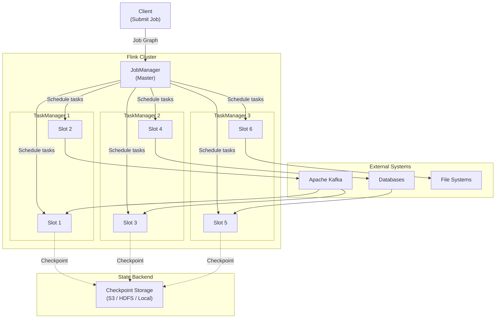
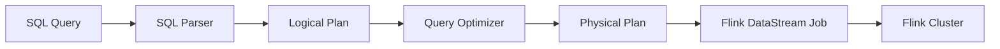
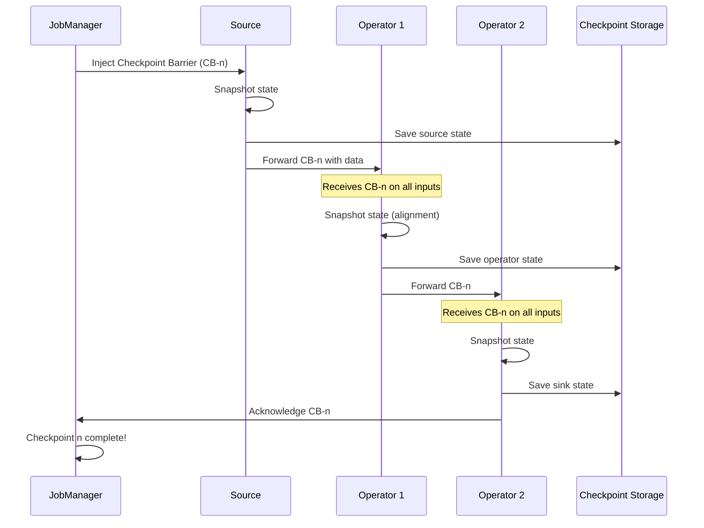
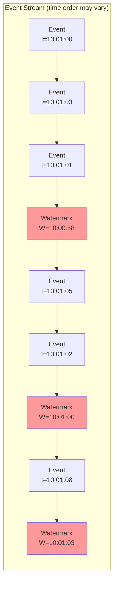
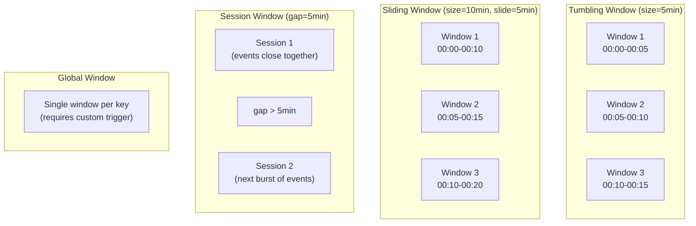
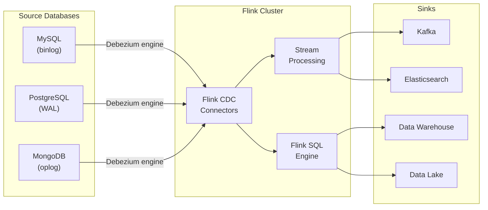

# Module 8: Apache Flink -- Real-Time Stream Processing

## Overview

Apache Flink is a **distributed stream processing framework** designed for stateful computations over unbounded and bounded data streams. While tools like Kafka Streams and ksqlDB handle stream processing at different levels of abstraction, Flink is the **industrial-strength engine** built for the most demanding real-time workloads -- millisecond latency, exactly-once guarantees, and petabyte-scale state.

> **Analogy -- The Factory Assembly Line:** Imagine a factory assembly line where raw materials (events) flow in continuously. Each station on the line (operator) performs a specific transformation -- inspecting, enriching, assembling, or packaging. The line never stops; it processes items as they arrive. A supervisor (JobManager) coordinates all the stations, while workers (TaskManagers) operate them. If a station breaks, the supervisor reroutes work to a backup station without losing a single item. That is Apache Flink.

---

## Table of Contents

1. [What is Apache Flink?](#what-is-apache-flink)
2. [Flink vs Other Stream Processors](#flink-vs-other-stream-processors)
3. [Architecture](#architecture)
4. [DataStream API Concepts](#datastream-api-concepts)
5. [Flink SQL](#flink-sql)
6. [PyFlink: Python API](#pyflink-python-api)
7. [Checkpointing and Savepoints](#checkpointing-and-savepoints)
8. [Watermarks and Event Time Processing](#watermarks-and-event-time-processing)
9. [Windows](#windows)
10. [State Backends](#state-backends)
11. [CDC with Flink](#cdc-with-flink)
12. [Key Takeaways](#key-takeaways)
13. [Next Steps](#next-steps)

---

## What is Apache Flink?

Apache Flink is an open-source, unified stream and batch processing framework. Unlike systems that bolt streaming onto a batch engine, Flink was **built streaming-first** from day one. Batch processing in Flink is simply a special case of stream processing -- a bounded stream.

### Core Capabilities

| Capability | Description |
|---|---|
| **True Streaming** | Processes events one at a time with low latency, not in micro-batches |
| **Stateful Processing** | Maintains large, fault-tolerant application state across operators |
| **Exactly-Once Semantics** | Guarantees each event is processed exactly once, even during failures |
| **Event Time Processing** | Handles out-of-order events using watermarks and event timestamps |
| **Unified Batch & Stream** | Same API and engine for both bounded and unbounded data |
| **Scalable** | Scales to thousands of cores and terabytes of application state |

### When to Use Flink

- **Complex Event Processing (CEP):** Detecting patterns across event streams (fraud detection, anomaly detection)
- **Real-Time Analytics:** Continuous aggregations, dashboards, and metrics
- **ETL / Data Pipelines:** Streaming ETL from databases (CDC), message queues, and files
- **Machine Learning:** Online feature computation and model serving
- **Session Analysis:** Tracking user sessions across web/mobile events

---

## Flink vs Other Stream Processors

| Feature | Apache Flink | Kafka Streams | ksqlDB | Faust |
|---|---|---|---|---|
| **Deployment** | Standalone cluster | Embedded in app | Standalone server | Embedded in app |
| **Language** | Java/Scala/Python/SQL | Java/Kotlin | SQL only | Python only |
| **State Management** | Managed, large state (TB+) | RocksDB local | ksqlDB managed | RocksDB/memory |
| **Exactly-Once** | Yes (end-to-end) | Yes (Kafka-to-Kafka) | Yes (Kafka-to-Kafka) | At-least-once |
| **Event Time** | Native watermarks | Yes | Yes (limited) | Basic support |
| **Windowing** | Tumbling, sliding, session, global, custom | Tumbling, sliding, session | Tumbling, hopping, session | Tumbling |
| **SQL Support** | Full Flink SQL | No | Native SQL | No |
| **Batch Processing** | Yes (unified) | No | No | No |
| **CDC Support** | Native (flink-cdc) | Via Kafka Connect | Via Kafka Connect | Via Kafka Connect |
| **Cluster Required** | Yes | No | Yes | No |
| **Scaling Model** | Task slots & parallelism | Kafka partitions | Kafka partitions | Kafka partitions |
| **Best For** | Complex, large-scale streaming | Microservice stream processing | SQL-based analytics | Python-native streaming |

**Rule of thumb:**
- Use **Flink** when you need industrial-grade streaming with large state, event-time processing, or SQL on streams.
- Use **Kafka Streams** when you want a lightweight library embedded in your Java microservice.
- Use **ksqlDB** when your team wants SQL-only stream processing without coding.
- Use **Faust** when your team is Python-first and needs simple stream processing.

---

## Architecture

### Architecture Overview



### Key Components

| Component | Role |
|---|---|
| **JobManager** | The brain of the cluster. Receives job submissions, creates the execution graph, schedules tasks across TaskManagers, coordinates checkpoints, and handles failover. |
| **TaskManager** | Worker processes that execute the actual data processing. Each TaskManager offers a fixed number of **task slots**. |
| **Task Slot** | A fixed subset of a TaskManager's resources (memory). Each slot can run one parallel pipeline of operators. Slots allow multiple tasks to share a single JVM. |
| **Parallelism** | The number of parallel instances of an operator. A parallelism of 4 means 4 copies of the operator run simultaneously across slots. |
| **Dispatcher** | Provides a REST interface for submitting jobs and serves the Flink Web UI. |
| **ResourceManager** | Manages TaskManager slots and communicates with external resource providers (YARN, Kubernetes, Mesos). |

### Parallelism and Slots

```
TaskManager 1 (4 slots):
┌──────────┬──────────┬──────────┬──────────┐
│  Slot 0  │  Slot 1  │  Slot 2  │  Slot 3  │
│ Source[0]│ Source[1]│ Source[2]│ Source[3]│
│   ↓      │   ↓      │   ↓      │   ↓      │
│  Map[0]  │  Map[1]  │  Map[2]  │  Map[3]  │
│   ↓      │   ↓      │   ↓      │   ↓      │
│ Sink[0]  │ Sink[1]  │ Sink[2]  │ Sink[3]  │
└──────────┴──────────┴──────────┴──────────┘

Parallelism = 4 → 4 subtasks per operator
Each slot runs a full pipeline slice (operator chaining)
```

### Deployment Modes

| Mode | Description | Use Case |
|---|---|---|
| **Session Mode** | Long-running cluster; multiple jobs share it | Development, interactive SQL |
| **Per-Job Mode** | Dedicated cluster per job; torn down after | Production (YARN) |
| **Application Mode** | Main() runs on the cluster, not the client | Production (Kubernetes) |

---

## DataStream API Concepts

The DataStream API is Flink's core API for stream processing. It provides fine-grained control over state, time, and processing logic.

### Execution Flow

```
Source → Transformation → Transformation → ... → Sink
```

### Key Abstractions

| Abstraction | Description |
|---|---|
| `StreamExecutionEnvironment` | Entry point for all Flink programs. Configures parallelism, checkpointing, and state backend. |
| `DataStream<T>` | A stream of elements of type T. Supports map, filter, keyBy, window, and more. |
| `KeyedStream<T, K>` | A DataStream partitioned by key. Required for windowed aggregations and keyed state. |
| `WindowedStream<T, K, W>` | A KeyedStream with a window assigned. Supports aggregations over time or count-based windows. |

### Common Operations

```
DataStream API Operations:

Source Operators:
  env.from_source(kafka_source)    -- Read from Kafka
  env.from_collection([1,2,3])     -- Read from in-memory collection
  env.read_text_file("path")       -- Read from file

Transformation Operators:
  stream.map(func)                 -- 1:1 transformation
  stream.flat_map(func)            -- 1:N transformation
  stream.filter(func)              -- Filter elements
  stream.key_by(key_selector)      -- Partition by key
  stream.reduce(func)              -- Rolling reduce on keyed stream
  stream.union(other_stream)       -- Merge streams (same type)
  stream.connect(other_stream)     -- Connect two streams (different types)

Window Operators:
  keyed.window(TumblingEventTimeWindows.of(Time.seconds(10)))
  keyed.window(SlidingProcessingTimeWindows.of(Time.minutes(1), Time.seconds(10)))
  keyed.window(EventTimeSessionWindows.withGap(Time.minutes(5)))

Sink Operators:
  stream.sink_to(kafka_sink)       -- Write to Kafka
  stream.add_sink(jdbc_sink)       -- Write to database
  stream.print()                   -- Print to stdout
```

---

## Flink SQL

Flink SQL brings the power of SQL to stream processing. You can create tables backed by Kafka topics, databases, or files, and query them with standard SQL -- including joins, aggregations, and windowed queries.

### How Flink SQL Works



### Creating Tables

```sql
-- Create a table backed by a Kafka topic
CREATE TABLE orders (
    order_id STRING,
    customer_id STRING,
    product_id STRING,
    amount DECIMAL(10, 2),
    order_time TIMESTAMP(3),
    WATERMARK FOR order_time AS order_time - INTERVAL '5' SECOND
) WITH (
    'connector' = 'kafka',
    'topic' = 'orders',
    'properties.bootstrap.servers' = 'kafka:29092',
    'properties.group.id' = 'flink-sql-consumer',
    'scan.startup.mode' = 'earliest-offset',
    'format' = 'json'
);
```

### Querying Streams

```sql
-- Continuous query: orders per minute
SELECT
    TUMBLE_START(order_time, INTERVAL '1' MINUTE) AS window_start,
    COUNT(*) AS order_count,
    SUM(amount) AS total_revenue
FROM orders
GROUP BY TUMBLE(order_time, INTERVAL '1' MINUTE);
```

### Flink SQL Connectors

| Connector | Use Case |
|---|---|
| `kafka` | Read from / write to Kafka topics |
| `upsert-kafka` | Upsert (key-based) writes to Kafka |
| `jdbc` | Read from / write to relational databases |
| `filesystem` | Read from / write to files (CSV, Parquet, JSON) |
| `mysql-cdc` | CDC from MySQL (Debezium under the hood) |
| `postgres-cdc` | CDC from PostgreSQL |
| `elasticsearch` | Write to Elasticsearch |
| `hbase` | Read from / write to HBase |

---

## PyFlink: Python API

PyFlink is the Python API for Apache Flink, providing access to both the DataStream API and Table API / SQL.

### PyFlink Architecture

```
Python User Code
       │
       ▼
  PyFlink API (Python)
       │
       ▼
  Py4J Bridge ──────► JVM (Flink Runtime)
       │                    │
       ▼                    ▼
  Python UDFs         Java Operators
  (via Beam Runner)   (native execution)
```

### Example: PyFlink Table API

```python
from pyflink.table import EnvironmentSettings, TableEnvironment

# Create a TableEnvironment for streaming
env_settings = EnvironmentSettings.in_streaming_mode()
t_env = TableEnvironment.create(env_settings)

# Define a source table via SQL
t_env.execute_sql("""
    CREATE TABLE source_table (
        word STRING
    ) WITH (
        'connector' = 'kafka',
        'topic' = 'words',
        'properties.bootstrap.servers' = 'kafka:29092',
        'format' = 'raw',
        'scan.startup.mode' = 'earliest-offset'
    )
""")

# Query with Table API
result = t_env.from_path("source_table") \
    .group_by(col("word")) \
    .select(col("word"), lit(1).count.alias("count"))
```

### PyFlink vs Java/Scala Flink

| Aspect | PyFlink | Java/Scala Flink |
|---|---|---|
| **Performance** | Slight overhead for Python UDFs | Native JVM performance |
| **API Coverage** | Table API + SQL (full), DataStream (growing) | Full API coverage |
| **UDFs** | Python UDFs via Apache Beam | Java/Scala UDFs (native) |
| **Ecosystem** | Pandas, NumPy, scikit-learn integration | JVM ecosystem |
| **Best For** | Data scientists, Python teams | Performance-critical apps |

---

## Checkpointing and Savepoints

Checkpointing is Flink's mechanism for **exactly-once fault tolerance**. It periodically snapshots the state of all operators so the job can recover from failures without data loss or duplication.

### How Checkpointing Works



### Checkpoint Barriers

```
Stream of records with checkpoint barriers:

... [record] [record] [CB-3] [record] [record] [CB-2] [record] [CB-1] ...
                        │                         │                │
                   Checkpoint 3             Checkpoint 2      Checkpoint 1
                   (newest)                                   (oldest)

Barriers flow with the data. When an operator receives a barrier
on ALL input channels, it snapshots its state.
```

### Configuration

```yaml
# In flink-conf.yaml or via API
execution.checkpointing.interval: 60000          # Every 60 seconds
execution.checkpointing.mode: EXACTLY_ONCE        # or AT_LEAST_ONCE
execution.checkpointing.timeout: 600000           # 10 minute timeout
execution.checkpointing.min-pause: 500            # Min pause between checkpoints
state.checkpoints.num-retained: 3                 # Keep last 3 checkpoints
execution.checkpointing.unaligned.enabled: true   # Unaligned checkpoints
```

### Savepoints vs Checkpoints

| Aspect | Checkpoint | Savepoint |
|---|---|---|
| **Trigger** | Automatic (periodic) | Manual (user-initiated) |
| **Purpose** | Fault tolerance | Planned maintenance, upgrades, scaling |
| **Lifecycle** | Managed by Flink (auto-cleanup) | Managed by user (manual cleanup) |
| **Format** | Optimized for speed | Portable across Flink versions |
| **Use Case** | Crash recovery | Job migration, A/B testing, forking |

### Triggering a Savepoint

```bash
# Create a savepoint
flink savepoint <job-id> s3://my-bucket/savepoints/

# Cancel job with savepoint
flink cancel -s s3://my-bucket/savepoints/ <job-id>

# Resume from savepoint
flink run -s s3://my-bucket/savepoints/savepoint-abc123 my-job.jar
```

---

## Watermarks and Event Time Processing

In the real world, events arrive **out of order** and **late**. Flink uses **event time** and **watermarks** to handle this correctly.

### Time Semantics

| Time Type | Description |
|---|---|
| **Event Time** | Timestamp embedded in the event itself (when it actually happened) |
| **Processing Time** | Wall-clock time of the machine processing the event |
| **Ingestion Time** | Timestamp assigned when the event enters Flink |

### What is a Watermark?

A watermark is a special marker in the stream that declares: **"No events with a timestamp less than W will arrive after this point."** It tells Flink when it is safe to close a window and emit results.

### Watermark Progression



```
Timeline of events and watermarks (allowed lateness = 5 seconds):

Event Time:    10:01:00  10:01:03  10:01:01  10:01:05  10:01:02  10:01:08
               ────────────────────────────────────────────────────────►
Watermarks:         W=10:00:55       W=10:00:58       W=10:01:00    W=10:01:03

Watermark = max_event_time - allowed_lateness
When W passes a window's end time, the window fires.
```

### Defining Watermarks in Flink SQL

```sql
CREATE TABLE events (
    event_id STRING,
    event_time TIMESTAMP(3),
    payload STRING,
    -- Declare watermark: allow 5 seconds of out-of-order-ness
    WATERMARK FOR event_time AS event_time - INTERVAL '5' SECOND
) WITH (
    'connector' = 'kafka',
    ...
);
```

### Defining Watermarks in PyFlink

```python
from pyflink.common import WatermarkStrategy, Duration

watermark_strategy = WatermarkStrategy \
    .for_bounded_out_of_orderness(Duration.of_seconds(5)) \
    .with_timestamp_assigner(MyTimestampAssigner())
```

### Handling Late Events

| Strategy | Description |
|---|---|
| **Drop** | Default. Late events after watermark are dropped. |
| **Allowed Lateness** | Window stays open for extra time to accept late events. |
| **Side Output** | Late events are sent to a separate "late" stream for special handling. |

---

## Windows

Windows group elements of a stream into finite buckets for aggregation. Flink supports several window types.

### Window Types



### Tumbling Windows

Non-overlapping, fixed-size windows. Every element belongs to exactly one window.

```sql
-- Flink SQL: tumbling window
SELECT
    TUMBLE_START(order_time, INTERVAL '1' MINUTE) AS window_start,
    TUMBLE_END(order_time, INTERVAL '1' MINUTE) AS window_end,
    COUNT(*) AS order_count
FROM orders
GROUP BY TUMBLE(order_time, INTERVAL '1' MINUTE);
```

### Sliding Windows

Overlapping windows. An element can belong to multiple windows.

```sql
-- Flink SQL: sliding (hopping) window -- 10-minute window, sliding every 1 minute
SELECT
    HOP_START(order_time, INTERVAL '1' MINUTE, INTERVAL '10' MINUTE) AS window_start,
    HOP_END(order_time, INTERVAL '1' MINUTE, INTERVAL '10' MINUTE) AS window_end,
    COUNT(*) AS order_count
FROM orders
GROUP BY HOP(order_time, INTERVAL '1' MINUTE, INTERVAL '10' MINUTE);
```

### Session Windows

Dynamic windows that close after a period of inactivity (gap).

```sql
-- Flink SQL: session window with 5-minute gap
SELECT
    SESSION_START(order_time, INTERVAL '5' MINUTE) AS session_start,
    SESSION_END(order_time, INTERVAL '5' MINUTE) AS session_end,
    customer_id,
    COUNT(*) AS event_count
FROM orders
GROUP BY SESSION(order_time, INTERVAL '5' MINUTE), customer_id;
```

### Global Windows

A single window per key that never closes on its own. Requires a custom trigger.

```python
# PyFlink: global window with count trigger
stream.key_by(lambda x: x.key) \
    .window(GlobalWindows.create()) \
    .trigger(CountTrigger.of(100)) \
    .reduce(my_reduce_function)
```

---

## State Backends

Flink operators can maintain **state** -- information that persists across events. The **state backend** determines how state is stored and checkpointed.

### Available State Backends

| Backend | Storage | State Size | Checkpoint Speed | Use Case |
|---|---|---|---|---|
| **HashMapStateBackend** | JVM Heap | Limited by heap | Fast (full snapshot) | Small state, development |
| **EmbeddedRocksDBStateBackend** | RocksDB on disk | Very large (TB+) | Incremental supported | Production, large state |

### HashMapStateBackend

```
┌─────────────────────────────────┐
│         JVM Heap Memory         │
│  ┌─────────┐  ┌─────────┐      │
│  │ State A │  │ State B │      │
│  │ (HashMap)│  │ (HashMap)│     │
│  └─────────┘  └─────────┘      │
│                                 │
│  Checkpoint: serialize entire   │
│  state to checkpoint storage    │
└─────────────────────────────────┘
```

- **Pros:** Very fast (in-memory), no serialization for reads/writes
- **Cons:** Limited by JVM heap, full snapshot on checkpoint, risk of GC pauses

### EmbeddedRocksDBStateBackend

```
┌─────────────────────────────────┐
│        TaskManager Process      │
│  ┌──────────────────────────┐   │
│  │     RocksDB Instance     │   │
│  │   (local SSD/disk)       │   │
│  │  ┌─────┐ ┌─────┐        │   │
│  │  │SST 1│ │SST 2│  ...   │   │
│  │  └─────┘ └─────┘        │   │
│  └──────────────────────────┘   │
│                                 │
│  Checkpoint: incremental --     │
│  only changed SST files         │
└─────────────────────────────────┘
```

- **Pros:** State can exceed memory, incremental checkpoints, production-proven
- **Cons:** Slower reads/writes (serialization + disk I/O), more complex tuning

### Configuration

```yaml
# flink-conf.yaml
state.backend: rocksdb
state.backend.rocksdb.localdir: /tmp/flink-rocksdb
state.backend.incremental: true
state.checkpoints.dir: s3://my-bucket/flink/checkpoints
state.savepoints.dir: s3://my-bucket/flink/savepoints
```

---

## CDC with Flink

Flink has **native CDC (Change Data Capture) support** through the `flink-cdc-connectors` project. This allows Flink to directly consume database changelogs without needing Kafka Connect or Debezium as a separate service.

### Flink CDC Architecture



### Flink CDC vs Debezium + Kafka Connect

| Aspect | Flink CDC | Debezium + Kafka Connect |
|---|---|---|
| **Architecture** | Single Flink job | Separate Connect cluster + Flink |
| **Latency** | Lower (direct) | Higher (extra hop through Kafka) |
| **Exactly-Once** | Built-in via Flink checkpoints | Requires careful configuration |
| **Transformations** | Inline with Flink SQL/DataStream | Requires separate consumer |
| **Schema Evolution** | Handled by Flink | Schema Registry integration |
| **Best For** | Real-time analytics on DB changes | Decoupled, multi-consumer CDC |

### Example: MySQL CDC in Flink SQL

```sql
CREATE TABLE mysql_orders (
    order_id INT,
    customer_id INT,
    product_id INT,
    amount DECIMAL(10, 2),
    status VARCHAR(50),
    created_at TIMESTAMP(3),
    updated_at TIMESTAMP(3),
    PRIMARY KEY (order_id) NOT ENFORCED
) WITH (
    'connector' = 'mysql-cdc',
    'hostname' = 'mysql',
    'port' = '3306',
    'username' = 'root',
    'password' = 'debezium',
    'database-name' = 'inventory',
    'table-name' = 'orders'
);

-- Now query it like any other table -- real-time!
SELECT status, COUNT(*), SUM(amount)
FROM mysql_orders
GROUP BY status;
```

---

## Key Takeaways

1. **Flink is streaming-first.** Unlike Spark Streaming (micro-batch), Flink processes events one at a time with true low-latency streaming.

2. **Architecture is simple but powerful.** JobManager coordinates, TaskManagers execute, and task slots provide resource isolation. Parallelism scales horizontally.

3. **Flink SQL is production-ready.** You can build complete streaming pipelines -- sources, transformations, joins, aggregations, and sinks -- entirely in SQL.

4. **Checkpointing enables exactly-once.** Checkpoint barriers flow through the stream, triggering consistent state snapshots. Savepoints extend this for planned maintenance.

5. **Watermarks handle real-world disorder.** Event time processing with watermarks lets you correctly aggregate over time windows even when events arrive out of order or late.

6. **Window variety covers all use cases.** Tumbling for non-overlapping buckets, sliding for moving averages, session for activity-based grouping, global for custom logic.

7. **State backends match your scale.** HashMapStateBackend for development and small state; RocksDB for production workloads with terabytes of state.

8. **Flink CDC is a game-changer.** Direct CDC from databases into Flink eliminates the need for a separate Connect cluster in many architectures.

9. **PyFlink opens Flink to Python teams.** While not as performant as Java for UDFs, PyFlink provides full access to Flink SQL and growing DataStream API support.

10. **Unified batch and stream.** The same Flink engine and API works for both real-time streams and historical batch processing -- no separate systems needed.

---

## Next Steps

Continue to **[Module 9: Capstone Project](../module-09-capstone/README.md)** where you will combine everything from Modules 1-8 into a complete, production-style streaming data platform.
