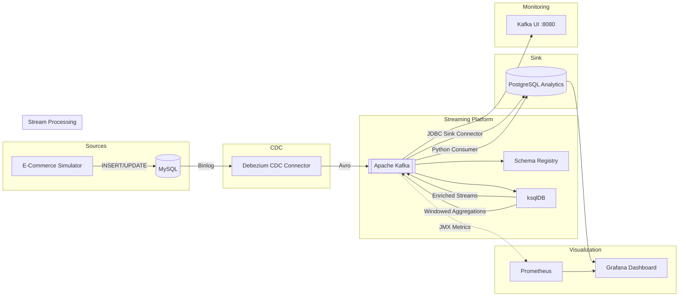

# Module 9: Capstone Project - Real-Time E-Commerce Analytics Platform

## Project Overview

This capstone project brings together every concept from the Data Streaming Mastery course into a single, production-grade real-time analytics platform. You will deploy a complete end-to-end streaming pipeline that captures changes from a transactional MySQL database, streams them through Kafka, enriches and aggregates data with ksqlDB, sinks results to PostgreSQL, and visualizes everything on a live Grafana dashboard.

An e-commerce simulator generates realistic traffic -- customer registrations, product purchases, order status transitions, cancellations, and returns -- so you can observe the entire pipeline in action.

---

## Architecture



### Component Summary

| Component | Port | Purpose |
|---|---|---|
| MySQL | 3306 | Transactional e-commerce database (source of truth) |
| Debezium (Kafka Connect) | 8083 | Change Data Capture from MySQL binlog |
| Apache Kafka | 9092 | Central event streaming backbone |
| Schema Registry | 8081 | Avro schema management |
| ksqlDB | 8088 | Real-time stream processing (enrichment, aggregation) |
| PostgreSQL | 5432 | Analytics sink database |
| Kafka UI | 8080 | Visual Kafka topic/consumer inspection |
| Grafana | 3000 | Real-time dashboards |
| Prometheus | 9090 | Metrics collection |

---

## What the Pipeline Does

1. **E-Commerce Simulator** writes realistic transactions to MySQL: new customers, orders with multiple items, status transitions (pending -> confirmed -> shipped -> delivered), occasional cancellations and returns.

2. **Debezium CDC** captures every INSERT/UPDATE from MySQL binlog and publishes Avro-encoded change events to Kafka topics (`ecommerce.ecommerce.orders`, `ecommerce.ecommerce.customers`, etc.).

3. **ksqlDB** processes these streams in real time:
   - Joins orders with customers and products to create an **enriched orders** stream
   - Computes **orders per minute** (1-minute tumbling window)
   - Computes **revenue per category** (5-minute tumbling window)
   - Computes **top customers by spend** (10-minute tumbling window)
   - Maintains an **order status distribution** table

4. **JDBC Sink Connector** (or Python consumer) writes the aggregated results to PostgreSQL analytics tables.

5. **Grafana** queries PostgreSQL every 5 seconds to display live dashboards.

---

## Prerequisites

- Docker and Docker Compose (v2+)
- Python 3.9+ with pip
- 8 GB RAM allocated to Docker (recommended)
- Ports 3000, 3306, 5432, 8080, 8081, 8083, 8088, 9090, 9092 available

---

## Quick Start

```bash
# 1. Install Python dependencies
pip install sqlalchemy pymysql confluent-kafka requests psycopg2-binary

# 2. Run the master setup script
chmod +x setup.sh teardown.sh
./setup.sh

# 3. Open Grafana
open http://localhost:3000
# Login: admin / admin (skip password change)
```

The setup script will:
- Start all Docker containers
- Wait for every service to become healthy
- Register the Debezium source connector
- Register the JDBC sink connector
- Submit ksqlDB queries
- Start the e-commerce simulator in the background

---

## How to Verify the Pipeline

### 1. Check Kafka Topics

Open Kafka UI at [http://localhost:8080](http://localhost:8080). You should see topics:
- `ecommerce.ecommerce.customers`
- `ecommerce.ecommerce.products`
- `ecommerce.ecommerce.orders`
- `ecommerce.ecommerce.order_items`
- `ecommerce.ecommerce.inventory_log`

### 2. Check Debezium Connector

```bash
curl -s http://localhost:8083/connectors/mysql-source-connector/status | python3 -m json.tool
```

Status should show `"state": "RUNNING"`.

### 3. Inspect ksqlDB

```bash
# List streams
curl -s http://localhost:8088/ksql -H 'Content-Type: application/vnd.ksql.v1+json' \
  -d '{"ksql": "SHOW STREAMS;"}' | python3 -m json.tool

# List tables
curl -s http://localhost:8088/ksql -H 'Content-Type: application/vnd.ksql.v1+json' \
  -d '{"ksql": "SHOW TABLES;"}' | python3 -m json.tool
```

### 4. Check PostgreSQL Analytics

```bash
docker exec -it module-09-postgres psql -U postgres -d analytics -c "SELECT * FROM orders_enriched LIMIT 5;"
docker exec -it module-09-postgres psql -U postgres -d analytics -c "SELECT * FROM revenue_per_minute ORDER BY window_start DESC LIMIT 5;"
```

### 5. Open Grafana Dashboard

Navigate to [http://localhost:3000](http://localhost:3000) (admin/admin). The **E-Commerce Real-Time Analytics** dashboard should auto-load with live data.

---

## Troubleshooting

| Problem | Solution |
|---|---|
| Containers won't start | Ensure Docker has at least 8 GB RAM. Run `docker system prune` to free space. |
| Debezium connector fails | Check MySQL is healthy: `docker logs module-09-mysql`. Ensure binlog is enabled. |
| No data in Kafka topics | Verify the simulator is running: `ps aux \| grep ecommerce_simulator`. Check connector status. |
| ksqlDB queries fail | Ensure Schema Registry is up. Check ksqlDB logs: `docker logs module-09-ksqldb-server`. |
| Grafana shows "No data" | Verify PostgreSQL has data. Check the JDBC sink connector status or run the Python sink consumer manually. |
| Port conflicts | Stop other services using the same ports, or edit `docker-compose.yml` to remap them. |

---

## Tear Down

```bash
./teardown.sh
```

This stops all containers and removes volumes.

---

## Key Takeaways

After completing this capstone, you have demonstrated mastery of:

1. **Change Data Capture** -- Debezium captures database changes without polling.
2. **Event Streaming** -- Kafka decouples producers from consumers and provides durable, ordered event logs.
3. **Schema Management** -- Schema Registry ensures data compatibility across the pipeline.
4. **Stream Processing** -- ksqlDB performs real-time joins, enrichment, and windowed aggregations with SQL.
5. **Data Sinking** -- JDBC Sink Connector and custom Python consumers materialize streaming results into analytical databases.
6. **Real-Time Visualization** -- Grafana dashboards provide instant visibility into business metrics.
7. **End-to-End Pipeline Orchestration** -- Docker Compose, health checks, and setup scripts bring all components together reliably.

---

## Next Steps

Proceed to [Module 10: Production Deployment](../module-10-production/) to learn how to take this pipeline to production with Kubernetes, monitoring, CI/CD, and operational best practices.
