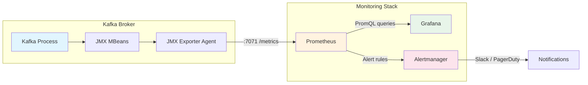
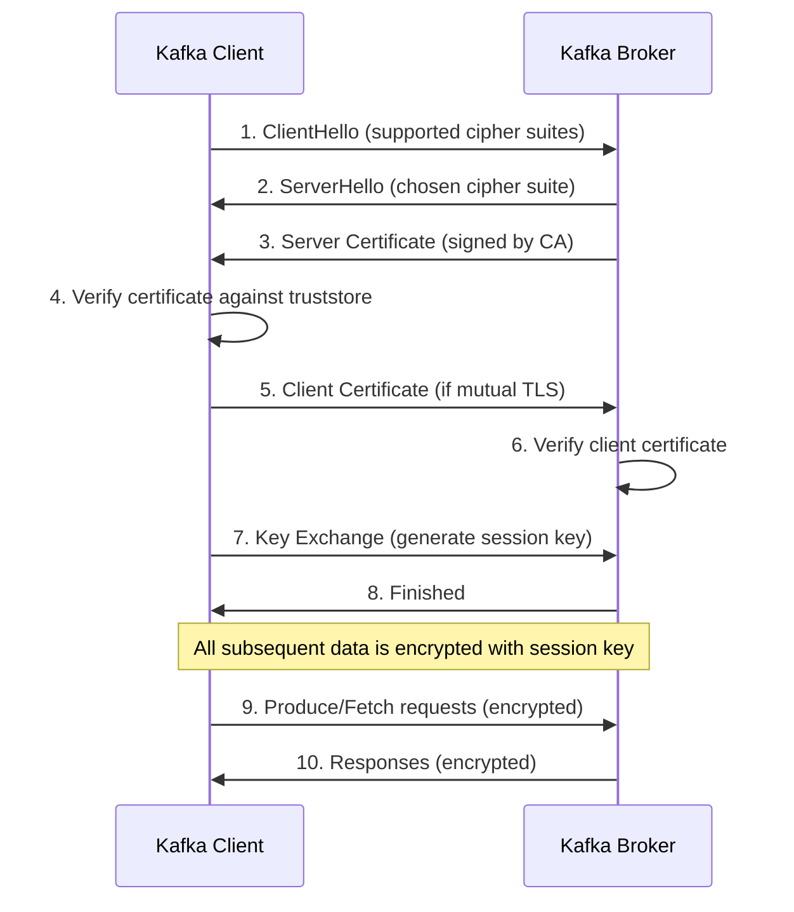
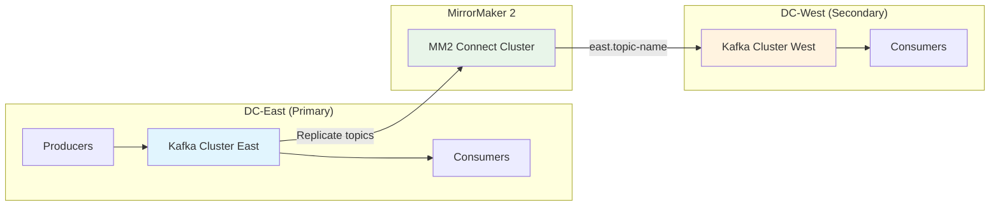
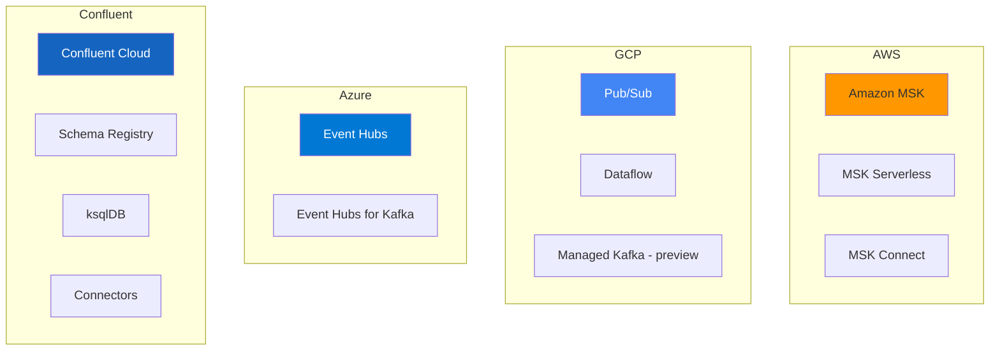

# Module 10: Production Considerations

## Table of Contents

1. [Monitoring Kafka](#monitoring-kafka)
2. [Monitoring Stack: JMX, Prometheus, and Grafana](#monitoring-stack-jmx-prometheus-and-grafana)
3. [Security](#security)
4. [Performance Tuning](#performance-tuning)
5. [Capacity Planning](#capacity-planning)
6. [Multi-Datacenter Patterns](#multi-datacenter-patterns)
7. [Cloud Deployment](#cloud-deployment)
8. [Schema Registry in Production](#schema-registry-in-production)
9. [Kafka Connect in Production](#kafka-connect-in-production)
10. [Disaster Recovery](#disaster-recovery)
11. [Key Takeaways](#key-takeaways)
12. [Congratulations](#congratulations)

---

## Monitoring Kafka

Running Kafka in production requires comprehensive monitoring. Without visibility into broker health, consumer lag, and resource utilization, small problems escalate into outages. This section covers the key metrics every Kafka operator must track.

### Key Metrics

#### Under-Replicated Partitions

Under-replicated partitions (URPs) indicate that one or more replicas are not in sync with the leader. This is the single most important metric for Kafka cluster health.

| Metric | MBean | Description |
|---|---|---|
| Under-Replicated Partitions | `kafka.server:type=ReplicaManager,name=UnderReplicatedPartitions` | Number of partitions where the follower is behind the leader |
| ISR Shrinks/Expands | `kafka.server:type=ReplicaManager,name=IsrShrinksPerSec` | Rate of ISR changes -- frequent changes indicate instability |
| Offline Partitions | `kafka.controller:type=KafkaController,name=OfflinePartitionsCount` | Partitions with no active leader -- data is unavailable |

**What to do when URPs spike:**

1. Check broker disk I/O -- followers may be unable to keep up due to slow disks
2. Check network throughput -- cross-rack replication may saturate links
3. Check if a broker recently restarted -- it takes time to catch up
4. Verify `replica.lag.time.max.ms` -- if set too low, transient slowdowns cause ISR churn

#### Consumer Lag

Consumer lag measures the difference between the latest message offset in a partition and the offset of the last message consumed by a consumer group. Rising lag means consumers cannot keep up with production rate.

| Metric | Source | Description |
|---|---|---|
| Records Lag Max | Consumer client metric | Maximum lag across all partitions for a consumer |
| Consumer Group Lag | `kafka-consumer-groups.sh --describe` | Per-partition lag for a consumer group |
| Commit Rate | Consumer client metric | Rate of offset commits -- dropping rate may indicate consumer issues |

**Common causes of consumer lag:**

- Processing logic is too slow (optimize or add consumers)
- Consumer group rebalancing (check session.timeout.ms and heartbeat.interval.ms)
- Uneven partition assignment (hot partitions with more data)
- Downstream dependency is slow (database writes, API calls)

#### Request Latency

| Metric | MBean | Description |
|---|---|---|
| Produce Request Latency | `kafka.network:type=RequestMetrics,name=TotalTimeMs,request=Produce` | Time to handle produce requests |
| Fetch Request Latency | `kafka.network:type=RequestMetrics,name=TotalTimeMs,request=FetchConsumer` | Time to handle consumer fetch requests |
| Request Queue Size | `kafka.network:type=RequestChannel,name=RequestQueueSize` | Number of queued requests -- high values indicate broker overload |
| Response Queue Size | `kafka.network:type=RequestChannel,name=ResponseQueueSize` | Number of queued responses |

#### Broker Health

| Metric | MBean | Description |
|---|---|---|
| Active Controller Count | `kafka.controller:type=KafkaController,name=ActiveControllerCount` | Should be exactly 1 across the cluster |
| Broker Count | Via ZooKeeper or AdminClient | Total number of live brokers |
| Log Flush Latency | `kafka.log:type=LogFlushStats,name=LogFlushRateAndTimeMs` | Time to flush log segments to disk |
| JVM Heap Usage | `java.lang:type=Memory` | JVM memory usage -- high pressure causes GC pauses |
| Network Processor Idle | `kafka.network:type=SocketServer,name=NetworkProcessorAvgIdlePercent` | Below 0.3 (30%) indicates network thread saturation |
| Request Handler Idle | `kafka.server:type=KafkaRequestHandlerPool,name=RequestHandlerAvgIdlePercent` | Below 0.3 indicates I/O thread saturation |

---

## Monitoring Stack: JMX, Prometheus, and Grafana

Kafka exposes metrics via Java Management Extensions (JMX). To collect these metrics in a modern monitoring pipeline, we use the **JMX Exporter** to translate JMX MBeans into Prometheus-compatible format, then visualize with Grafana.



### How JMX Exporter Works

The JMX Exporter runs as a **Java agent** inside the Kafka broker JVM. It reads MBeans and exposes them as Prometheus metrics on an HTTP endpoint (typically port 7071).

```bash
# The JMX Exporter is configured via KAFKA_OPTS environment variable
KAFKA_OPTS: "-javaagent:/opt/jmx-exporter/jmx_prometheus_javaagent.jar=7071:/opt/jmx-exporter/kafka-jmx-config.yml"
```

### Prometheus Scraping

Prometheus periodically scrapes the JMX Exporter endpoint:

```yaml
scrape_configs:
  - job_name: 'kafka'
    static_configs:
      - targets: ['kafka:7071']
    scrape_interval: 15s
```

### Grafana Dashboards

Grafana connects to Prometheus as a data source and renders dashboards with panels for each metric. The `docker-compose.yml` in this module provisions a complete monitoring stack with:

- Pre-configured Prometheus scraping
- Pre-configured Grafana datasource (Prometheus)
- Pre-built Kafka monitoring dashboard

### Running the Monitoring Stack

```bash
# Start the full stack
docker-compose up -d

# Access Grafana at http://localhost:3000 (admin/admin)
# Access Prometheus at http://localhost:9090
# Access Kafka UI at http://localhost:8080

# Generate load for monitoring
pip install -r requirements.txt
python src/monitoring_producer.py
```

---

## Security

Kafka supports multiple layers of security: encryption in transit, authentication, and authorization.

### SSL/TLS Encryption (In-Transit)

SSL/TLS encrypts data flowing between clients and brokers, and between brokers themselves (inter-broker communication). This prevents eavesdropping and man-in-the-middle attacks.



#### Key Concepts

- **Keystore**: Contains the broker's or client's own private key and certificate. This is the identity.
- **Truststore**: Contains the CA certificate(s) that the broker/client trusts. Used to verify the other party's identity.
- **CA (Certificate Authority)**: Signs certificates. Both client and broker trust the same CA.

#### Broker Configuration for SSL

```properties
# Listener configuration
listeners=SSL://0.0.0.0:9093
advertised.listeners=SSL://broker1:9093
security.inter.broker.protocol=SSL

# SSL configuration
ssl.keystore.location=/var/kafka/ssl/kafka.broker.keystore.jks
ssl.keystore.password=broker-ks-password
ssl.key.password=broker-key-password
ssl.truststore.location=/var/kafka/ssl/kafka.broker.truststore.jks
ssl.truststore.password=broker-ts-password

# Require client authentication (mutual TLS)
ssl.client.auth=required

# Protocol and cipher configuration
ssl.enabled.protocols=TLSv1.3,TLSv1.2
ssl.protocol=TLSv1.3
```

#### Client Configuration for SSL

```python
from confluent_kafka import Producer

producer = Producer({
    'bootstrap.servers': 'broker1:9093',
    'security.protocol': 'SSL',
    'ssl.ca.location': '/path/to/ca-cert.pem',
    'ssl.certificate.location': '/path/to/client-cert.pem',
    'ssl.key.location': '/path/to/client-key.pem',
    'ssl.key.password': 'client-key-password',
})
```

The `config/ssl-setup.sh` script in this module generates all necessary certificates for demonstration purposes.

### SASL Authentication

SASL (Simple Authentication and Security Layer) provides username/password or ticket-based authentication.

#### SASL Mechanisms

| Mechanism | Description | Use Case |
|---|---|---|
| **PLAIN** | Simple username/password (cleartext without SSL) | Development, or combined with SSL in production |
| **SCRAM-SHA-256/512** | Salted Challenge Response -- password never sent over wire | Production without Kerberos infrastructure |
| **GSSAPI (Kerberos)** | Ticket-based authentication via KDC | Enterprise environments with existing Kerberos |
| **OAUTHBEARER** | Token-based authentication (OAuth 2.0) | Cloud-native environments, integration with identity providers |

#### SASL/PLAIN Broker Configuration

```properties
listeners=SASL_PLAINTEXT://0.0.0.0:9092
security.inter.broker.protocol=SASL_PLAINTEXT
sasl.mechanism.inter.broker.protocol=PLAIN
sasl.enabled.mechanisms=PLAIN

# JAAS configuration
listener.name.sasl_plaintext.plain.sasl.jaas.config=\
  org.apache.kafka.common.security.plain.PlainLoginModule required \
  username="admin" \
  password="admin-secret" \
  user_admin="admin-secret" \
  user_producer="producer-secret" \
  user_consumer="consumer-secret";
```

#### SASL/SCRAM Broker Configuration

```properties
listeners=SASL_SSL://0.0.0.0:9094
security.inter.broker.protocol=SASL_SSL
sasl.mechanism.inter.broker.protocol=SCRAM-SHA-512
sasl.enabled.mechanisms=SCRAM-SHA-512

# SCRAM credentials are stored in ZooKeeper
# Create credentials with:
# kafka-configs.sh --zookeeper localhost:2181 --alter \
#   --add-config 'SCRAM-SHA-512=[password=producer-secret]' \
#   --entity-type users --entity-name producer
```

#### Kerberos Overview

Kerberos is a network authentication protocol that uses tickets granted by a Key Distribution Center (KDC). It is common in enterprise Hadoop/big-data environments.

Key components:
- **KDC (Key Distribution Center)**: Central authentication server
- **Keytab**: File containing the principal's encrypted key (used instead of passwords)
- **Principal**: Identity in the form `kafka/broker1.example.com@REALM`

Kerberos setup is complex and typically managed by a dedicated infrastructure team. The broker configuration requires:

```properties
sasl.enabled.mechanisms=GSSAPI
sasl.kerberos.service.name=kafka
listener.name.sasl_ssl.gssapi.sasl.jaas.config=\
  com.sun.security.auth.module.Krb5LoginModule required \
  useKeyTab=true \
  keyTab="/etc/security/keytabs/kafka.keytab" \
  storeKey=true \
  principal="kafka/broker1.example.com@EXAMPLE.COM";
```

### ACLs (Authorization)

After authentication, ACLs control what authenticated users can do. Kafka's built-in `AclAuthorizer` manages permissions.

```bash
# Enable ACLs on the broker
authorizer.class.name=kafka.security.authorizer.AclAuthorizer
super.users=User:admin

# Grant produce permission to user "producer" on topic "orders"
kafka-acls.sh --bootstrap-server localhost:9092 \
  --add --allow-principal User:producer \
  --operation Write --topic orders

# Grant consume permission to user "consumer" on topic "orders" with group "order-processors"
kafka-acls.sh --bootstrap-server localhost:9092 \
  --add --allow-principal User:consumer \
  --operation Read --topic orders \
  --group order-processors

# List all ACLs
kafka-acls.sh --bootstrap-server localhost:9092 --list

# Common ACL operations
# Read    -- consume from topic
# Write   -- produce to topic
# Create  -- create topics
# Delete  -- delete topics
# Alter   -- change topic configuration
# Describe -- view topic metadata
# ClusterAction -- inter-broker replication
```

---

## Performance Tuning

### Producer Tuning

| Parameter | Default | Description | Tuning Guidance |
|---|---|---|---|
| `batch.size` | 16384 (16 KB) | Maximum bytes per batch per partition | Increase to 65536-131072 for throughput. Larger batches = fewer requests but higher latency. |
| `linger.ms` | 0 | Time to wait for additional messages before sending a batch | Set to 5-100ms. Allows batches to fill up, improving throughput at the cost of slight latency. |
| `compression.type` | none | Compression codec (none, gzip, snappy, lz4, zstd) | Use `lz4` or `zstd` for best throughput/ratio tradeoff. `gzip` has highest ratio but highest CPU. `snappy` is fastest but lower ratio. |
| `acks` | all | Number of acknowledgments (0, 1, all) | `acks=all` for durability. `acks=1` for balance. `acks=0` for maximum throughput (fire-and-forget, risk of data loss). |
| `buffer.memory` | 33554432 (32 MB) | Total memory for buffering unsent messages | Increase if producer blocks due to full buffer. Monitor `buffer-available-bytes` metric. |
| `max.in.flight.requests.per.connection` | 5 | Max unacknowledged requests per connection | Set to 1 if strict ordering is required (with `enable.idempotence=false`). With idempotence enabled, up to 5 maintains ordering. |
| `enable.idempotence` | true (Kafka 3.x) | Prevents duplicate messages on retry | Keep enabled for exactly-once semantics. Requires `acks=all`. |

#### Producer Throughput vs. Latency Tradeoffs

```
High Throughput Config:         Low Latency Config:
  batch.size=131072               batch.size=16384
  linger.ms=50                    linger.ms=0
  compression.type=lz4            compression.type=none
  acks=1                          acks=1
  buffer.memory=67108864          buffer.memory=33554432
```

### Consumer Tuning

| Parameter | Default | Description | Tuning Guidance |
|---|---|---|---|
| `fetch.min.bytes` | 1 | Minimum bytes to return per fetch | Increase to 1024-65536 to reduce fetch requests. Broker waits until this much data is available. |
| `fetch.max.wait.ms` | 500 | Max time broker waits for fetch.min.bytes | Paired with fetch.min.bytes. Lower = lower latency, higher = better batching. |
| `max.poll.records` | 500 | Max records returned per poll() call | Reduce if processing is slow and you hit `max.poll.interval.ms`. Increase if processing is fast. |
| `max.poll.interval.ms` | 300000 (5 min) | Max time between poll() calls before consumer is considered dead | Increase if processing takes long. If exceeded, consumer is removed from the group. |
| `max.partition.fetch.bytes` | 1048576 (1 MB) | Max bytes per partition per fetch | Increase if messages are large. Must be larger than max message size. |
| `session.timeout.ms` | 45000 | Time without heartbeat before consumer is removed | Lower values detect failures faster but may cause unnecessary rebalances. |
| `auto.offset.reset` | latest | Where to start if no committed offset | `earliest` to process all data, `latest` to skip historical data. |

### Broker Tuning

| Parameter | Default | Description | Tuning Guidance |
|---|---|---|---|
| `num.io.threads` | 8 | Threads for disk I/O operations | Set to number of disks or 2x disks. Monitor request handler idle percent. |
| `num.network.threads` | 3 | Threads for network requests | Set to number of CPUs / 2. Monitor network processor idle percent. |
| `num.replica.fetchers` | 1 | Threads for replicating from leader | Increase to 2-4 if replication lag is high. |
| `log.segment.bytes` | 1073741824 (1 GB) | Size of a single log segment file | Smaller segments = more frequent log rolling and cleanup. Larger = fewer files but slower recovery. |
| `log.retention.hours` | 168 (7 days) | How long to retain log segments | Set based on reprocessing needs. Use `log.retention.bytes` for size-based retention. |
| `log.cleanup.policy` | delete | How to handle old segments (delete or compact) | Use `compact` for changelog/state topics. Use `delete` for event streams. |
| `message.max.bytes` | 1048588 (~1 MB) | Max message size the broker accepts | Increase if needed, but large messages hurt performance. Consider chunking. |
| `socket.send.buffer.bytes` | 102400 | TCP send buffer size | Increase to 1048576 for high-throughput, high-latency networks. |
| `socket.receive.buffer.bytes` | 102400 | TCP receive buffer size | Increase to 1048576 for high-throughput, high-latency networks. |

---

## Capacity Planning

### Estimating Throughput

To plan Kafka capacity, start with your data requirements:

```
Given:
  - Message rate: 100,000 messages/sec
  - Average message size: 1 KB
  - Replication factor: 3
  - Retention: 7 days
  - Compression ratio: 0.5 (50% with lz4)

Calculations:
  Raw throughput = 100,000 msg/sec x 1 KB = 100 MB/sec
  With compression = 100 MB/sec x 0.5 = 50 MB/sec (network)
  With replication = 50 MB/sec x 3 = 150 MB/sec (total broker disk write)

  Per broker (3 brokers) = 150 / 3 = 50 MB/sec disk write per broker
```

### Estimating Storage

```
  Daily storage (compressed) = 50 MB/sec x 86,400 sec = 4.32 TB/day (total cluster)
  Per broker = 4.32 / 3 = 1.44 TB/day
  7-day retention = 1.44 TB x 7 = 10.08 TB per broker
  With 20% overhead = ~12 TB per broker
```

### Partition Count Guidelines

- **Rule of thumb**: Start with `max(num_brokers, num_consumers)` partitions per topic
- **For throughput**: If a single partition sustains ~10 MB/sec, and you need 100 MB/sec, use at least 10 partitions
- **Upper bound**: Keep total partitions per broker under 4,000 (Kafka 3.x with KRaft supports more)
- **Consumer parallelism**: Number of partitions = maximum consumer parallelism in a consumer group
- **Do not over-partition**: More partitions = more file handles, longer leader elections, more memory

### Replication Factor

| Factor | Durability | Availability | Storage Cost |
|---|---|---|---|
| 1 | No redundancy | Single broker failure = data loss | 1x |
| 2 | Survives 1 broker failure | Limited -- no replicas during recovery | 2x |
| 3 (recommended) | Survives 2 broker failures | High -- `min.insync.replicas=2` + `acks=all` | 3x |

**Production recommendation**: Replication factor 3 with `min.insync.replicas=2`. This ensures durability (survives 1 broker failure while still accepting writes) and is the industry standard.

---

## Multi-Datacenter Patterns

### MirrorMaker 2

MirrorMaker 2 (MM2) is the built-in tool for replicating data across Kafka clusters. It is based on Kafka Connect and supports:

- Topic replication with automatic offset translation
- Consumer group offset sync
- Automatic topic creation on the destination
- Heartbeat and checkpoint topics for monitoring



### Active-Passive

In an active-passive setup, one datacenter handles all writes while the other maintains a replica for disaster recovery.

**Characteristics:**
- All producers write to the primary cluster
- MM2 replicates data to the secondary cluster
- Consumers can read from either cluster (for read scaling)
- Failover: redirect producers and consumers to the secondary cluster
- **RPO (Recovery Point Objective)**: Depends on replication lag (typically seconds)
- **RTO (Recovery Time Objective)**: Depends on failover automation (minutes to hours)

**Pros:** Simple, no conflict resolution needed
**Cons:** Wasted capacity in passive DC, failover is not instant, offset translation required

### Active-Active

In an active-active setup, both datacenters accept writes and replicate to each other.

**Characteristics:**
- Producers in each DC write to their local cluster
- MM2 replicates bidirectionally with topic prefixing (e.g., `east.orders`, `west.orders`)
- Consumers aggregate data from both prefixed and local topics
- No single point of failure

**Challenges:**
- Topic naming: MM2 prefixes replicated topics (`east.orders` vs `orders`)
- Avoiding replication loops: MM2 handles this with provenance headers
- Consumers must handle data from multiple sources
- Conflict resolution if same entity is modified in both DCs

**Pros:** No wasted capacity, lower latency for local producers, no failover needed
**Cons:** Complex consumer logic, potential data conflicts, higher operational complexity

---

## Cloud Deployment



### AWS MSK (Managed Streaming for Apache Kafka)

Amazon MSK is a fully managed Apache Kafka service.

**Key features:**
- Runs open-source Apache Kafka (not a proprietary API)
- Manages brokers, ZooKeeper (or KRaft), patching, and monitoring
- Integrates with AWS IAM, VPC, CloudWatch, and AWS Glue Schema Registry
- MSK Serverless: auto-scaling, pay-per-use (no broker management)
- MSK Connect: managed Kafka Connect with auto-scaling

**Considerations:**
- Broker instance types affect throughput (kafka.m5.large, kafka.m5.2xlarge, etc.)
- Storage: EBS volumes, auto-scaling available
- Networking: runs inside your VPC, cross-AZ charges apply
- No built-in ksqlDB or Faust -- bring your own stream processing

### Confluent Cloud

Confluent Cloud is a fully managed Kafka service by the creators of Kafka.

**Key features:**
- Fully managed Kafka, Schema Registry, ksqlDB, Kafka Connect
- Multi-cloud: AWS, GCP, Azure
- Cluster types: Basic (development), Standard, Dedicated, Enterprise
- Stream Governance: schema management, data lineage, audit logs
- Pay-per-use pricing based on throughput (CKUs for Dedicated)

**Considerations:**
- Highest feature completeness (ksqlDB, connectors, etc.)
- Premium pricing compared to self-managed or MSK
- Vendor lock-in for Confluent-specific features

### Azure Event Hubs

Azure Event Hubs provides a Kafka-compatible endpoint on top of its native event streaming service.

**Key features:**
- Kafka protocol compatibility (clients connect using standard Kafka protocol)
- Native Azure integration (Azure AD, Azure Monitor, Event Grid)
- Tiered pricing: Basic, Standard, Premium, Dedicated
- Capture: automatic data archival to Azure Blob Storage or Data Lake

**Considerations:**
- Not Apache Kafka under the hood -- some Kafka features are unsupported
- No log compaction, no exactly-once semantics
- Good for Azure-native workloads, not ideal for Kafka-specific features

### GCP Datastream and Pub/Sub

Google Cloud offers Pub/Sub (a native messaging service) and a managed Kafka service (in preview).

**Key features:**
- Pub/Sub: serverless, global, at-least-once delivery, no partition management
- Dataflow: managed Apache Beam for stream processing
- Managed Kafka (preview): Apache Kafka on GCP infrastructure

**Considerations:**
- Pub/Sub is not Kafka -- different API, different semantics
- If you need Kafka on GCP, consider Confluent Cloud or self-managed on GKE

---

## Schema Registry in Production

### High Availability Setup

In production, Schema Registry should run as a cluster of multiple instances behind a load balancer.

**Architecture:**
- Schema Registry stores schemas in a Kafka topic (`_schemas`)
- One instance is the **primary** (handles writes), others are **secondary** (handle reads)
- If the primary fails, a new primary is elected automatically
- All instances share the same `_schemas` topic

**Configuration for HA:**

```properties
# Run multiple instances with the same group.id
kafkastore.group.id=schema-registry-cluster
leader.eligibility=true

# Configure the Kafka bootstrap servers
kafkastore.bootstrap.servers=PLAINTEXT://kafka1:9092,kafka2:9092,kafka3:9092

# Schema topic replication
kafkastore.topic=_schemas
kafkastore.topic.replication.factor=3
```

### Backup and Recovery

- **Topic backup**: The `_schemas` topic is compacted. Back it up with MirrorMaker 2 or `kafka-console-consumer`.
- **Export schemas**: Use the Schema Registry REST API to export all schemas:

```bash
# List all subjects
curl http://schema-registry:8081/subjects

# Export a specific schema
curl http://schema-registry:8081/subjects/orders-value/versions/latest

# Full backup script: iterate over subjects and versions
for subject in $(curl -s http://schema-registry:8081/subjects | jq -r '.[]'); do
  versions=$(curl -s "http://schema-registry:8081/subjects/$subject/versions" | jq -r '.[]')
  for version in $versions; do
    curl -s "http://schema-registry:8081/subjects/$subject/versions/$version" > "backup/${subject}_v${version}.json"
  done
done
```

---

## Kafka Connect in Production

### Distributed Mode

In production, always run Kafka Connect in **distributed mode**:

```properties
# Distributed mode configuration
group.id=connect-cluster
bootstrap.servers=kafka1:9092,kafka2:9092,kafka3:9092

# Internal topics (must have replication factor >= 3 in production)
config.storage.topic=connect-configs
config.storage.replication.factor=3
offset.storage.topic=connect-offsets
offset.storage.replication.factor=3
offset.storage.partitions=25
status.storage.topic=connect-status
status.storage.replication.factor=3
status.storage.partitions=5

# Converters
key.converter=io.confluent.connect.avro.AvroConverter
key.converter.schema.registry.url=http://schema-registry:8081
value.converter=io.confluent.connect.avro.AvroConverter
value.converter.schema.registry.url=http://schema-registry:8081
```

### Scaling

- **Horizontal scaling**: Add more Connect workers to the same `group.id`. Tasks are automatically redistributed.
- **Task parallelism**: Increase `tasks.max` in connector configuration to run more tasks per connector.
- **Dedicated workers**: Run source and sink connectors on separate worker groups to isolate failures.

### Monitoring Kafka Connect

| Metric | Description |
|---|---|
| `connector-count` | Number of deployed connectors |
| `task-count` | Number of running tasks |
| `connector-status` | RUNNING, PAUSED, FAILED, UNASSIGNED |
| `task-status` | RUNNING, FAILED |
| `source-record-poll-rate` | Records polled per second (source connectors) |
| `sink-record-send-rate` | Records sent per second (sink connectors) |
| `offset-commit-success-percentage` | Percentage of successful offset commits |

```bash
# Check connector status via REST API
curl http://connect:8083/connectors/my-connector/status

# Restart a failed task
curl -X POST http://connect:8083/connectors/my-connector/tasks/0/restart

# Pause / Resume a connector
curl -X PUT http://connect:8083/connectors/my-connector/pause
curl -X PUT http://connect:8083/connectors/my-connector/resume
```

---

## Disaster Recovery

### Backup Strategies

#### Topic Mirroring with MirrorMaker 2

The primary disaster recovery strategy for Kafka is **topic mirroring** to a secondary cluster.

```properties
# mm2.properties
clusters = primary, dr
primary.bootstrap.servers = kafka-primary:9092
dr.bootstrap.servers = kafka-dr:9092

# Replicate from primary to DR
primary->dr.enabled = true
primary->dr.topics = .*

# Sync consumer group offsets
primary->dr.sync.group.offsets.enabled = true
primary->dr.emit.checkpoints.enabled = true

# Do not replicate back
dr->primary.enabled = false
```

#### Consumer Offset Backup

Consumer group offsets can be exported and restored:

```bash
# Export consumer group offsets
kafka-consumer-groups.sh --bootstrap-server kafka:9092 \
  --group my-app --describe --export > offsets.csv

# Reset consumer group offsets on DR cluster
kafka-consumer-groups.sh --bootstrap-server kafka-dr:9092 \
  --group my-app --reset-offsets --from-file offsets.csv --execute
```

#### Configuration Backup

Back up all topic configurations and ACLs:

```bash
# Export topic configurations
kafka-topics.sh --bootstrap-server kafka:9092 --describe > topics-backup.txt

# Export ACLs
kafka-acls.sh --bootstrap-server kafka:9092 --list > acls-backup.txt
```

### Failover Procedures

1. **Verify DR cluster health**: Ensure all brokers are running and replication is caught up
2. **Stop MirrorMaker 2**: Prevent further replication to avoid conflicts
3. **Translate consumer offsets**: Use MM2 checkpoint topics to translate offsets
4. **Redirect producers**: Update producer bootstrap.servers to DR cluster
5. **Redirect consumers**: Update consumer bootstrap.servers to DR cluster
6. **Verify data flow**: Confirm producers and consumers are functioning on DR cluster
7. **Monitor**: Watch for consumer lag and error rates after failover

### Recovery Time Objectives

| Scenario | RPO | RTO | Strategy |
|---|---|---|---|
| Broker failure (single) | 0 (with replication) | Seconds | Automatic leader election |
| AZ failure | 0 (with rack-aware replication) | Seconds-Minutes | Automatic failover |
| Region failure | Seconds (replication lag) | Minutes-Hours | MM2 + DNS failover |
| Data corruption | Varies | Hours | Backup restore |

---

## Key Takeaways

1. **Monitor under-replicated partitions and consumer lag** -- these are the two most critical metrics for Kafka cluster health.

2. **Use JMX Exporter + Prometheus + Grafana** -- this is the industry-standard monitoring stack for Kafka in production.

3. **Security is layered** -- combine SSL/TLS (encryption), SASL (authentication), and ACLs (authorization) for defense in depth.

4. **Tune producers for your use case** -- batch.size + linger.ms for throughput, acks for durability, compression for efficiency.

5. **Tune consumers to match processing capacity** -- adjust max.poll.records and processing timeouts to prevent rebalances.

6. **Plan capacity with replication in mind** -- storage and network costs multiply by the replication factor.

7. **Use MirrorMaker 2 for multi-DC** -- it handles topic replication, offset translation, and cycle detection.

8. **Managed services reduce operational burden** -- MSK, Confluent Cloud, and Event Hubs each have tradeoffs in feature completeness, cost, and vendor lock-in.

9. **Schema Registry and Kafka Connect need HA** -- run multiple instances and use replicated internal topics.

10. **Practice disaster recovery** -- a backup strategy you have not tested is not a real strategy. Run failover drills.

---

## Congratulations

You have completed **Data Streaming Mastery** -- all 10 modules covering the full spectrum of real-time data streaming.

### What You Have Learned

| Module | Topic |
|---|---|
| 1 | Fundamentals of event streaming and messaging |
| 2 | Kafka core: producers, consumers, topics, partitions |
| 3 | Schema Registry: Avro, Protobuf, JSON Schema, compatibility |
| 4 | Kafka Connect: source and sink connectors, SMTs |
| 5 | Change Data Capture with Debezium |
| 6 | ksqlDB: stream processing with SQL |
| 7 | Faust: Python-native stream processing |
| 8 | Apache Flink: stateful stream processing at scale |
| 9 | Capstone: end-to-end streaming pipeline |
| 10 | Production: monitoring, security, performance, DR |

### Where to Go From Here

- **Build a production pipeline** -- take a real use case from your work and implement it end to end
- **Contribute to open source** -- Kafka, Faust, Debezium, and Flink all welcome contributions
- **Get certified** -- Confluent offers the Confluent Certified Developer and Confluent Certified Administrator exams
- **Explore advanced topics** -- exactly-once semantics deep dive, Kafka internals (log structure, controller protocol), KRaft migration
- **Join the community** -- Apache Kafka mailing lists, Confluent Community Slack, Stack Overflow

Thank you for completing this course. The skills you have built -- designing streaming architectures, implementing producers and consumers, managing schemas, building processing pipelines, and operating Kafka in production -- are in high demand across the industry. Go build something great.
