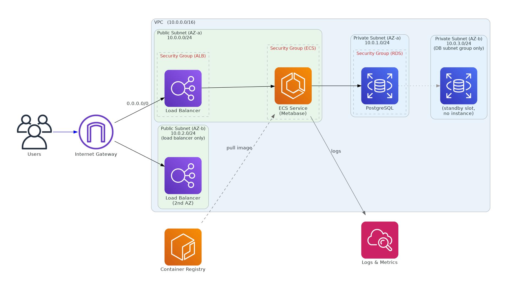

## 1. Architecture

## 

## 2. Step-by-Step Build

### Step 1 — VPC and Subnets

1. **VPC Console → Create VPC → VPC and more** (this wizard sets up subnets, route tables, and the internet gateway together)
2. Name tag: `metabase-vpc`
3. IPv4 CIDR: `10.0.0.0/16`
4. Number of Availability Zones: **2** — RDS requires a DB subnet group spanning at least 2 AZs even for a single-AZ database, and the ALB separately requires subnets in at least 2 AZs. Building both AZs now avoids adding subnets manually later.
5. Public subnets: **2**
6. Private subnets: **2**
7. NAT gateways: **None**
8. VPC endpoints: **None**
9. DNS options: leave both **Enable DNS resolution** and **Enable DNS hostnames** checked (default). DNS resolution lets things inside the VPC turn hostnames — like your RDS endpoint — into IP addresses; without it, Metabase can't connect to Postgres by hostname. DNS hostnames assigns public DNS names to public-IP resources like your ECS task; not strictly required for reaching Docker Hub, but it's the safe default and avoids odd behavior with other AWS services later.
10. Create VPC.

This gives you `metabase-vpc` with two public subnets (each routed to the internet) and two private subnets (no internet route), spread across two AZs, plus the internet gateway itself.

### Step 2 — IAM Role

1. **IAM → Roles → Create role**
2. Trusted entity type: **AWS service**
3. Use case: **Elastic Container Service → Elastic Container Service Task**
4. Attach policy: **`AmazonECSTaskExecutionRolePolicy`** (AWS managed) — we still need this for the CloudWatch logging permission, even though the ECR-related permissions inside it go unused (see the Theory guide, Section 4.4).
5. Name: `metabaseTaskExecutionRole`
6. Create role.

Leave the task role blank wherever a task definition asks for one — see the Theory guide, Section 4.5, for why.

### Step 3 — Security Groups

**EC2 Console → Security Groups → Create security group**, three times, using the table below. Create them in order — `metabase-alb-sg` → `metabase-ecs-sg` → `metabase-rds-sg` — so each one can reference the one before it as an inbound source. Leave the default outbound rule (allow all traffic) as-is on all three — see the Theory guide, Section 4.6, for why.

| Security group    | VPC            | Inbound rule                                                                        | Outbound rule       |
| ----------------- | -------------- | ----------------------------------------------------------------------------------- | ------------------- |
| `metabase-alb-sg` | `metabase-vpc` | Type: HTTP, Protocol: TCP, Port: 80, Source: `0.0.0.0/0`                            | Default (allow all) |
| `metabase-ecs-sg` | `metabase-vpc` | Type: Custom TCP, Protocol: TCP, Port: 3000, Source: **Custom → `metabase-alb-sg`** | Default (allow all) |
| `metabase-rds-sg` | `metabase-vpc` | Type: PostgreSQL, Protocol: TCP, Port: 5432, Source: **Custom → `metabase-ecs-sg`** | Default (allow all) |

For each, the inbound **Source** field is a search box, not a plain dropdown — set **Source type** to **Custom**, then start typing the earlier group's name or `sg-` ID for it to appear as an option. This is also why the creation order matters: `metabase-alb-sg` must already exist before you can pick it as `metabase-ecs-sg`'s source, and likewise for `metabase-ecs-sg` when creating `metabase-rds-sg`.

**If an earlier security group doesn't show up as a source option:** double-check the **VPC** field at the top of the create page is set to `metabase-vpc` — security groups are scoped to a VPC, and the inbound rule source field only lists groups from the _same_ VPC you're currently creating this one in. Also confirm the earlier group finished creating (refresh the list).

### Step 4 — RDS PostgreSQL

1. **RDS Console → Create database**
2. Engine: **PostgreSQL**
3. Template: **Free tier** (or Dev/Test)
4. DB instance identifier: `metabase-db`
5. Master username: `metabase_admin`; set a master password (you'll need it in Step 6)
6. Instance class: `db.t3.micro` (or `db.t4g.micro`)
7. Storage: 20 GB gp3, no autoscaling
8. **Multi-AZ: No**
9. Connectivity → VPC: `metabase-vpc`; DB subnet group: create new, using both private subnets. This isn't giving you redundancy today — with Multi-AZ off, your database only ever runs in one of the two subnets. AWS just requires every DB subnet group to span 2+ AZs structurally, so that switching to Multi-AZ later (Theory guide, Section 5) is a config change instead of a rebuild. Public access: **No**
10. VPC security group: existing → `metabase-rds-sg` (remove the default one). This is what actually enforces "only the ECS task can reach this database" — the subnet placement alone (Theory guide, Section 2) blocks internet access, but something still needs to define _which_ resources inside the VPC are allowed to connect, and that's the security group's job (Theory guide, Section 4.6).
11. Initial database name: `metabase`
12. Create database (takes 5–10 minutes).
13. Once it's up, note the **endpoint** hostname — you'll need it in Step 6.

### Step 5 — ECS Cluster

1. **ECS Console → Clusters → Create cluster**
2. Name: `metabase-cluster`
3. Infrastructure: **AWS Fargate (serverless)**
4. Create.

### Step 6 — Task Definition

1. **ECS Console → Task definitions → Create new task definition**
2. Family name: `metabase-task`
3. Launch type: **AWS Fargate**
4. OS/architecture: Linux/X86_64
5. Task size: 1 vCPU, 2 GB memory
6. **Task execution role**: `metabaseTaskExecutionRole`
7. **Task role**: none
8. Container:
   - Name: `metabase`
   - Image URI: `metabase/metabase:latest` — the public Docker Hub image, pulled directly; no account ID or registry login needed
   - Port mappings: container port **3000**, TCP
   - Environment variables:

     | Key            | Value                           |
     | -------------- | ------------------------------- |
     | `MB_DB_TYPE`   | `postgres`                      |
     | `MB_DB_DBNAME` | `metabase`                      |
     | `MB_DB_PORT`   | `5432`                          |
     | `MB_DB_USER`   | `metabase_admin`                |
     | `MB_DB_PASS`   | _(RDS master password)_         |
     | `MB_DB_HOST`   | _(RDS endpoint from Step 4.13)_ |

   - Log collection: enable — this auto-creates a log group like `/ecs/metabase-task`

9. Create.

### Step 7 — Application Load Balancer

1. **EC2 Console → Load Balancers → Create → Application Load Balancer**
2. Name: `metabase-alb`
3. Scheme: **Internet-facing**
4. VPC: `metabase-vpc`; mappings: select both public subnets (one per AZ) — this is why we built 2 AZs in Step 1
5. Security group: `metabase-alb-sg`
6. Listener: HTTP:80 → forward to a new target group
7. Target group:
   - Type: **IP** (required for Fargate)
   - Name: `metabase-tg`
   - Protocol/port: HTTP / 3000
   - Health check path: `/api/health`
8. Finish.

### Step 8 — ECS Service

1. `metabase-cluster` → **Create Service**
2. Task definition: `metabase-task`, latest revision
3. Service name: `metabase-service`
4. Desired tasks: **1**
5. Networking: VPC `metabase-vpc`, subnet: either public subnet (with only 1 task running, one is enough), security group `metabase-ecs-sg`
6. **Public IP: ON** (needed to reach Docker Hub without a NAT Gateway)
7. Load balancer: existing ALB `metabase-alb` → existing target group `metabase-tg`
8. Create service.

ECS will now launch the task, pull the image from Docker Hub, start the container, and register it with the target group once the health check passes — usually 2–4 minutes.

### Step 9 — Verify in CloudWatch

**CloudWatch → Log groups → `/ecs/metabase-task`** → open the latest log stream. You should see Metabase's startup logs ending in "Metabase Initialization COMPLETE." If you see repeated connection errors instead, double-check the RDS endpoint/password in Step 6, and that `metabase-rds-sg` allows traffic from `metabase-ecs-sg`.

### Step 10 — Open Metabase in Your Browser

1. EC2 Console → Load Balancers → `metabase-alb` → copy the **DNS name**
2. Go to `http://<alb-dns-name>` in your browser
3. You should land on the Metabase setup wizard.

If you get a 503/504 from the load balancer, the target group probably hasn't marked the task healthy yet — wait a minute, check target group health, and check the CloudWatch logs from Step 9.

---

## 3. Teardown

Delete in this order, to avoid dependency errors:

1. **ECS Service** → set desired count to 0, then delete
2. **ECS Cluster** → delete `metabase-cluster`
3. **Load Balancer** → delete `metabase-alb`, then target group `metabase-tg`
4. **RDS** → delete `metabase-db` (skip the final snapshot for a throwaway workshop DB)
5. **Security Groups** → delete `metabase-ecs-sg`, `metabase-rds-sg`, `metabase-alb-sg`, in that order
6. **VPC** → "Delete VPC" cleans up the subnets, route tables, and internet gateway together
